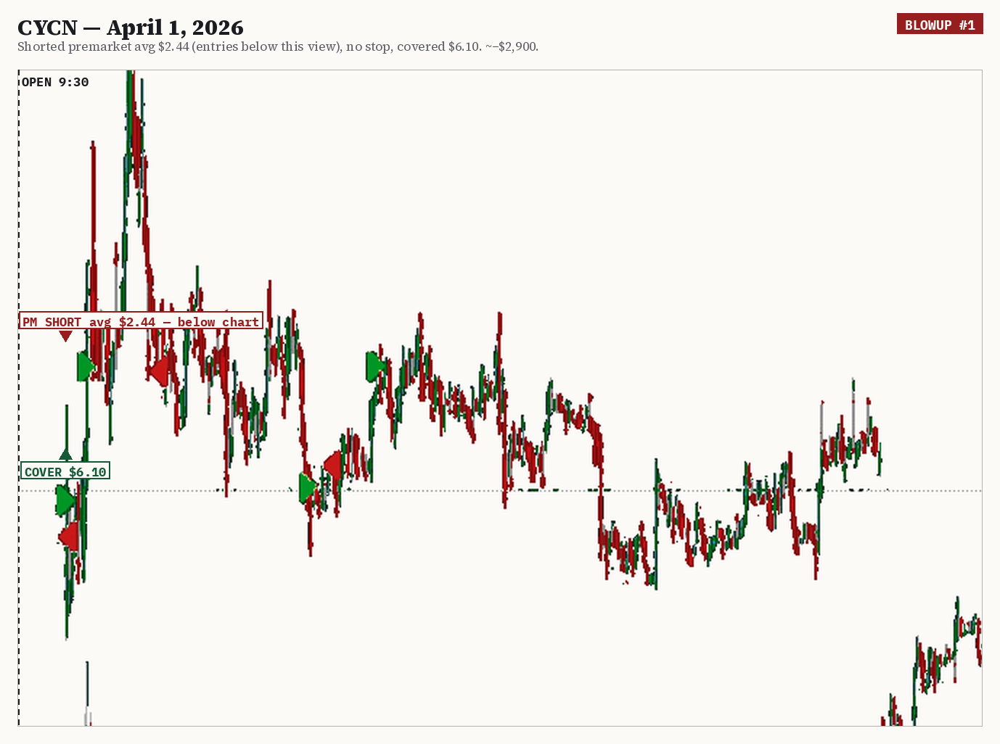
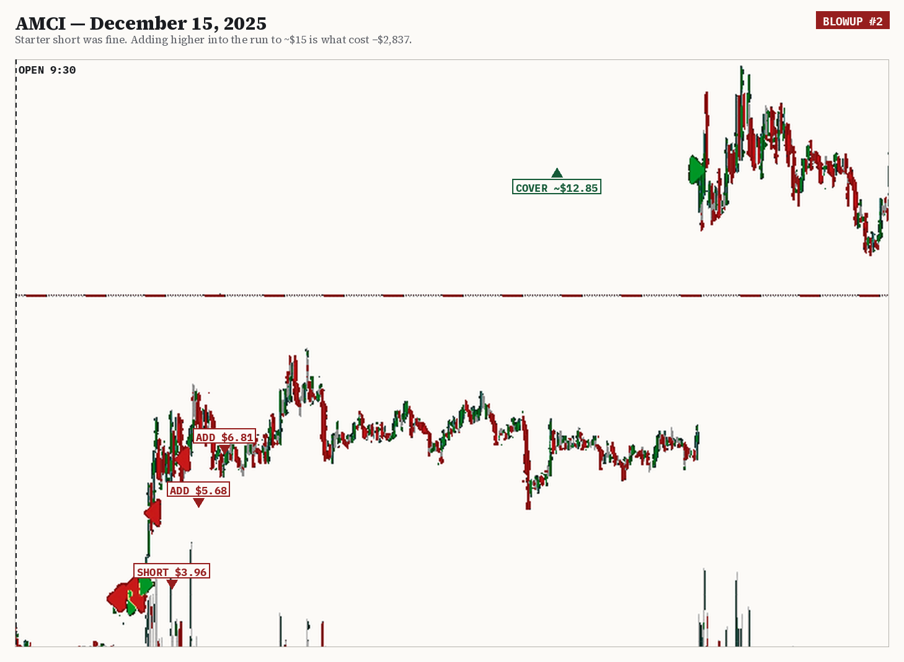
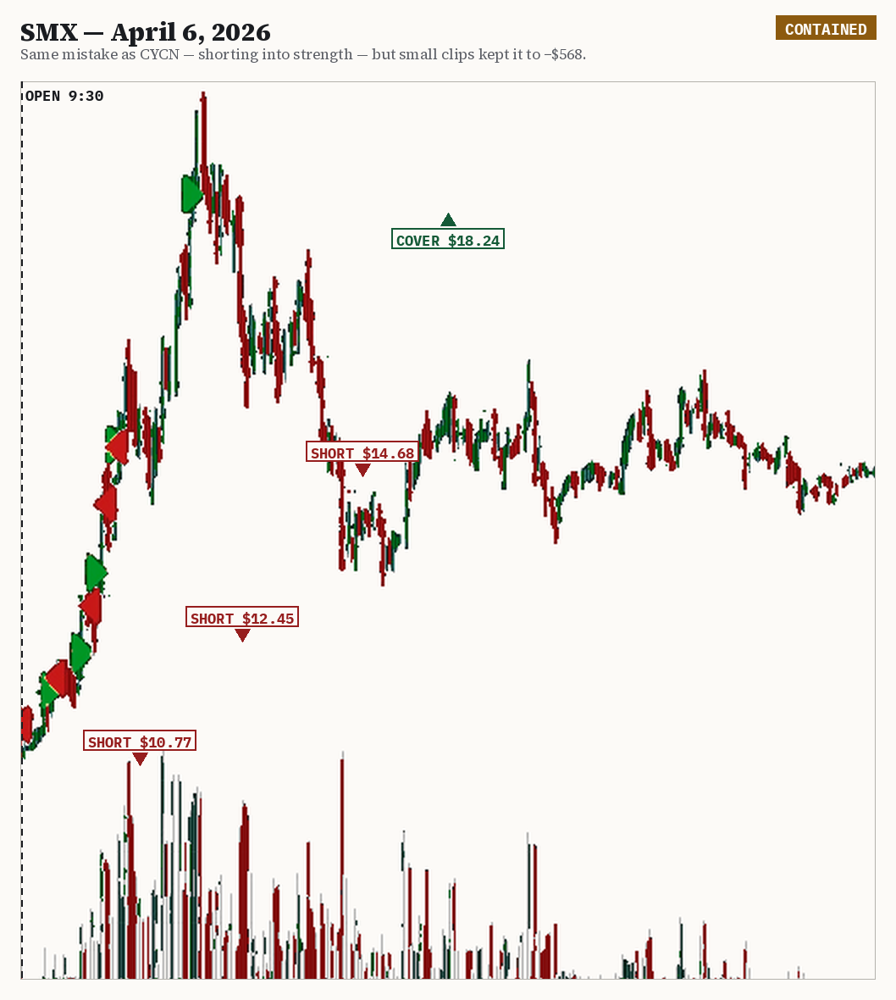
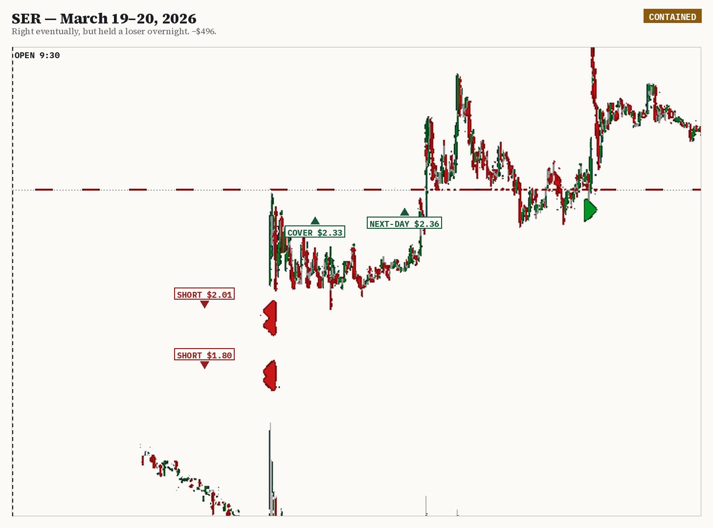
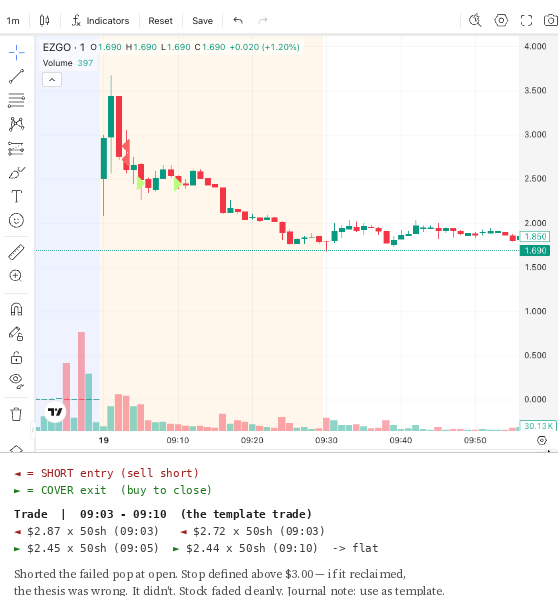
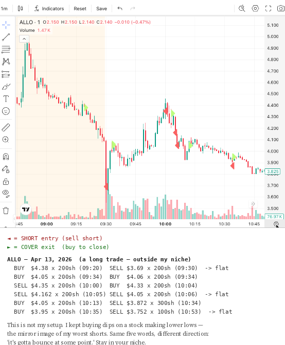
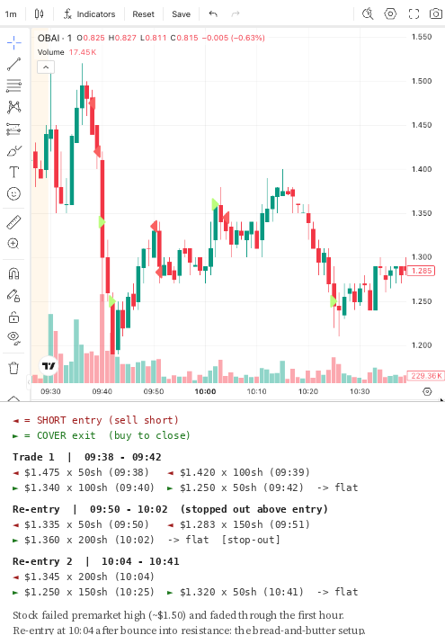
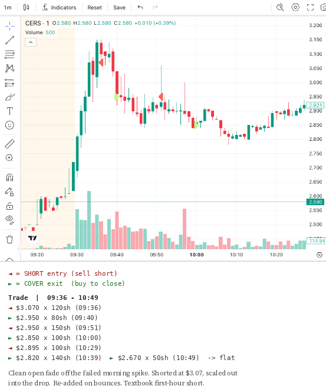

# Derechos {.unnumbered .unlisted}

*Cómo hacer trading desde Chile*

© 2026 Chris Ruzicka. Todos los derechos reservados.

Publicado por The Operator Library.

Ninguna parte de este libro puede ser reproducida, distribuida o transmitida de ninguna forma sin el permiso previo por escrito del autor, salvo citas breves en reseñas y ciertos usos no comerciales permitidos por la ley de derechos de autor.

Las marcas, nombres de empresas, plataformas y productos mencionados pertenecen a sus respectivos dueños y se usan solo con fines descriptivos y educativos. Su mención no implica respaldo de ellos hacia este libro ni del autor hacia ellos.

Primera edición · 2026

# Aviso importante {.unnumbered .unlisted}

Una nota antes de comenzar. Este libro es **solo para fines educativos**. No es asesoramiento financiero, legal ni tributario, y no soy un asesor financiero licenciado, ni abogado, ni contador. Nada de lo que aparece aquí debe interpretarse como una recomendación de inversión personalizada.

Hacer trading implica un **riesgo significativo de pérdida de capital**. Mucha gente pierde dinero. Los resultados pasados —incluidos los descritos en este libro— no garantizan ni predicen resultados futuros. Siempre haz tu propia investigación y consulta con un profesional calificado en Chile antes de tomar decisiones financieras, legales o tributarias.

A lo largo del libro describo herramientas, brokers y proveedores que he usado o investigado **personalmente**. Las condiciones, tarifas, mínimos, disponibilidad y reglas de esos servicios **cambian constantemente** y pueden ser distintas para tu país o tu situación. Nada de eso es una recomendación. **Verifica cada dato directamente con el proveedor antes de abrir una cuenta o transferir dinero.**

# Divulgación de links de referido {.unnumbered .unlisted}

Algunos links en este libro pueden ser links de afiliado o referido. Puedo recibir compensación si te registras a través de ellos, sin costo adicional para ti. Solo menciono herramientas, brokers o comunidades que he usado personalmente o estudiado. La compensación por referido **no** determina lo que incluyo, y siempre debes hacer tu propia investigación antes de abrir una cuenta o pagar por cualquier servicio.

---

# Antes de empezar

> Tres preguntas honestas antes de la primera página de contenido: si este libro es para ti, si no lo es, y cómo sacarle el máximo provecho.

## Para quién es este libro

Este libro es para ti si **estás en Chile, sientes curiosidad por el trading, y quieres entender cómo funciona de verdad operar mercados internacionales antes de arriesgar tu dinero.** No asumo que ya sepas lo que es un broker, un spread o un stop. Empezamos desde el principio y construimos desde ahí.

Es también para ti si **ya operas un poco pero sigues perdiendo dinero sin entender por qué** — y por fin estás dispuesto a mirar las causas con honestidad, incluso cuando es incómodo. Esa fue exactamente mi situación durante años.

Y es para ti si estás cansado de que casi todo el material de trading esté escrito por estadounidenses, para estadounidenses, como si todo el mundo viviera en Nueva York con un banco estadounidense. Yo no. Opero desde Chile, y hay realidades de hacerlo desde acá que ningún libro en inglés te va a contar.

## Para quién no es este libro

Voy a ahorrarte tiempo siendo claro. **Este libro no es para ti si:**

- **Buscas hacerte rico rápido** o quieres que alguien te prometa ganancias. No lo hago y no confío en nadie que lo haga.
- **Buscas alertas o señales para copiar** sin entender. No doy alertas. Nunca lo haré. Te enseñan a depender de otra persona — lo contrario de lo que necesitas para sobrevivir en este juego.
- **No estás dispuesto a llevar un registro** de tus operaciones. Este libro trata de mirarte honestamente con los números. Si eso no es algo que vas a hacer, no obtendrás mucho de esto.
- **Quieres certeza.** No la tengo, y desconfío de quien la venda. Esto trata de probabilidades, control de riesgo y disciplina — no de predicciones.

## Cómo usar este libro

Está dividido en dos partes, y el orden importa.

**La Parte 1 — *Cómo hacer trading desde Chile*** es el terreno práctico: qué significa operar mercados internacionales desde acá, cómo funcionan los brokers, la moneda, los horarios, los costos y los riesgos básicos. Si recién partes, esta parte te quita la venda de los ojos antes de arriesgar un peso.

**La Parte 2 — *Mis grandes pérdidas y cómo evitarlas con un sistema*** es el corazón del libro. Ahí abro mis propios números —incluyendo mis peores operaciones, en dólares reales— y construyo, paso a paso, el sistema de riesgo y disciplina que me habría ahorrado la matrícula más cara de mi vida.

Cada capítulo termina con un recuadro **"Para llevarte"** con la idea central, y varios incluyen un ejercicio **"Intenta esto"**. No los saltes: esos ejercicios *son* el libro. Leerlo te da las ideas; hacerlos te da el cambio.

Una sugerencia: léelo una vez completo para tener el mapa. Luego vuelve a la Parte 2 con tu propio historial de operaciones al lado y haz los ejercicios sobre tus números reales. Ahí es donde un libro deja de ser información y empieza a ser tu sistema.

---

# Parte 1 — Cómo hacer trading desde Chile {.part}

> El terreno práctico: qué significa operar mercados internacionales desde Chile, y todo lo que conviene entender —brokers, moneda, dinero, horarios, costos y riesgo— antes de poner un peso en juego.

---

## Capítulo 1 — Qué significa hacer trading internacional desde Chile

Empecemos por lo más básico, porque casi nadie lo explica con claridad.

Cuando hablo de "hacer trading desde Chile", **no** me refiero a comprar acciones chilenas en la Bolsa de Santiago. Me refiero a algo distinto: **operar mercados internacionales —principalmente el mercado de acciones de Estados Unidos— desde tu casa en Chile, a través de internet.**

Eso es perfectamente posible hoy. No necesitas vivir en Nueva York, no necesitas un banco estadounidense, y no necesitas un traje. Necesitas internet estable, una cuenta con un **broker** internacional (Capítulo 4), y dinero que puedas permitirte perder mientras aprendes.

### Por qué casi toda la educación de trading es gringa

Si has buscado material para aprender, ya lo notaste: la enorme mayoría está escrita por estadounidenses, para estadounidenses. Asumen que vives en una zona horaria de EE.UU., que tienes un banco estadounidense, que abres cuenta en cualquier broker sin fricción, y que tus gastos y tu capital están en la misma moneda.

Para ti, en Chile, **nada de eso es automático.** Tu banco es chileno, tu sueldo es en pesos, tu broker probablemente está afuera, y entre tu cuenta corriente y el mercado hay varias capas de conversión, transferencias y horarios que el material gringo simplemente ignora. Este libro existe en gran parte para llenar ese vacío.

### Lo que opero, en una frase

Para que tengas contexto del resto del libro: yo opero **small caps de Estados Unidos** —empresas pequeñas, de mucho movimiento— y la mayor parte del tiempo lo hago **en corto** (apostando a que un precio sobreextendido baje). Explicaré cada uno de esos términos en la Parte 2. No tienes que operar lo mismo que yo. Uso mi experiencia real como ejemplo porque es lo que conozco con números en la mano, errores incluidos.

### Lo bueno y lo difícil de hacerlo desde acá

Aquí va lo bueno y lo difícil, sin adornos.

**Lo bueno:** la zona horaria de Chile es sorprendentemente cómoda para operar el mercado de EE.UU. (Capítulo 7). La tecnología que necesitas es accesible. Y no tienes que operar todo el día — yo opero solo la primera hora.

**Lo difícil:** operar desde el extranjero tiene **costos y fricción más altos** —comisiones, conversión de moneda, transferencias internacionales, a veces menos opciones de broker— que alguien sentado en EE.UU. Esos costos no te impiden operar, pero hacen que la **disciplina y la selectividad no sean opcionales**. Es un tema que vamos a repetir, porque es la diferencia entre sobrevivir y desangrarte lento.

::: takeaway
**Para llevarte:** Hacer trading desde Chile significa operar mercados internacionales por internet, con reglas de precio de corto plazo. Es posible y accesible — pero la educación gringa ignora tu realidad (banco, moneda, horarios, fricción). Empieza entendiendo el terreno antes de arriesgar un peso.
:::

---

## Capítulo 2 — Trading vs inversión

La gente usa estas dos palabras como si significaran lo mismo. No significan lo mismo. Ni siquiera son el mismo deporte. Y confundirlas es una de las primeras formas en que alguien se prepara silenciosamente para perder.

Déjame ser directo.

Un **inversor** compra una parte de un negocio y espera que ese negocio valga más con el tiempo. La escala es de **años o décadas**. El riesgo principal es el desempeño del negocio. Es lo que hace Warren Buffett. Es honorable, históricamente rentable para quien tiene paciencia, y completamente distinto de lo que hago yo.

Un **trader** compra o vende un activo porque cree que el precio se moverá en una dirección en un **período corto** — horas, minutos, días. No le importa tanto si el negocio es bueno a diez años. Le importa si el precio se mueve de una manera que pueda leer, con riesgo controlado. Eso es todo.

### La conversión lenta — y por qué es peligrosa

La confusión más costosa se ve así: compras una acción esperando que suba. No sube. En lugar de salir con una pérdida pequeña, empiezas a decirte que es una "inversión a largo plazo". Te has convertido en inversor **involuntario**.

A veces la acción se recupera, y eso te enseña la lección equivocada: que aguantar es sabio, que esperar funciona, que no necesitas un stop. Y un día el precio no vuelve, y esa pérdida pequeña que no quisiste aceptar se convierte en un agujero enorme.

Para quien opera **en corto** (vendiendo acciones prestadas para apostar a que bajen — lo explico en detalle en la Parte 2), esta conversión es aún más violenta: una posición que se niega a cerrar **puede explotar** hacia arriba sin techo. No es teoría. Piensa en GameStop en 2021, cuando los que estaban cortos y no cerraron vieron multiplicarse el precio en su contra. La lección del mercado es siempre la misma, y vale la pena tatuársela: **si crees que algo no puede pasar, el mercado te humillará y te enseñará que todo puede pasar.**

Un perdedor mantenido en el lado largo sangra. Un perdedor mantenido en el lado corto puede detonar.

### Requieren cosas opuestas de ti

Piensa en lo que te pide cada uno.

Invertir te pide **no hacer nada**, a menudo durante años. La parte más difícil es quedarte quieto mientras las noticias gritan que actúes. El enemigo del inversor es su propio impulso de moverse.

El trading te pide **actuar** — con rapidez y disciplina mecánica. El enemigo del trader es su propio impulso de no salir cuando debe.

Una persona puede ser buena en ambas. Pero las habilidades, el temperamento que requieren, y los errores que te destruyen son diferentes. Yo soy trader — no porque la inversión sea inferior, sino porque el corto plazo encaja con cómo pienso. La posición te dice qué es; lo que tú le digas es irrelevante para el mercado.

::: takeaway
**Para llevarte:** Si mantienes una posición perdedora y empiezas a llamarla "inversión", eso es una señal de alerta, no una estrategia. El mercado no sabe —ni le importa— qué historia te estás contando.
:::

---

## Capítulo 3 — Qué necesitas antes de empezar

Antes de abrir una cuenta o ver un solo gráfico, hagamos una lista honesta de lo que realmente necesitas. No es una lista de compras cara. Es una lista de condiciones.

**1. Dinero que puedas permitirte perder.** No el arriendo. No los ahorros de emergencia. No dinero prestado. Mientras aprendes, debes asumir que podrías perderlo todo, porque mucha gente lo hace. Si perder tu cuenta cambiaría tu vida, tu cuenta es demasiado grande.

**2. Internet estable y un computador decente.** No necesitas una estación de seis pantallas. Necesitas una conexión que no se caiga en el momento equivocado y una plataforma que funcione con fluidez. Desde Chile, una caída de internet en medio de una operación es un riesgo real — ten un plan B (datos móviles, por ejemplo) para poder cerrar una posición si tu conexión principal falla.

**3. Tiempo en la ventana correcta.** El mercado de EE.UU. abre a una hora específica (Capítulo 7). No necesitas todo el día —yo opero solo la primera hora— pero necesitas estar disponible y concentrado en esa ventana, no operando a escondidas en una reunión.

**4. Disposición a llevar un registro.** Vas a anotar cada operación: qué hiciste, por qué, y qué resultó. Sin esto, estás confiando en tu memoria para mejorar, y tu memoria miente a tu favor. Este es, sin exagerar, el hábito que hizo posible este libro.

**5. Expectativas realistas.** No vas a renunciar a tu trabajo el mes uno. La meta inicial **no es ganar dinero** — es probar que puedes seguir un sistema bajo presión sin destruir tu cuenta. El dinero, si llega, viene después de la disciplina, no antes.

**6. Estómago para la incertidumbre.** Vas a perder operaciones. A menudo. El juego no es no perder — es perder **pequeño y controlado** mientras tus aciertos pagan más de lo que cuestan tus errores.

Hay una condición extra para quien opera desde Chile: **tolerancia a la fricción.** Mover dinero, convertir monedas y esperar transferencias internacionales toma tiempo y cuesta. Si esperas que todo sea instantáneo como una app local, te vas a frustrar. Mejor saberlo de entrada.

::: takeaway
**Para llevarte:** Lo que más necesitas no se compra: dinero que puedas perder, una conexión confiable, tiempo en la ventana correcta, y la disposición a registrar y revisar lo que haces. Si te falta el punto 1 o el punto 4, espera antes de empezar.
:::

---

## Capítulo 4 — Brokers y cuentas internacionales

Un **broker** es la empresa que te da acceso al mercado: la cuenta donde pones tu dinero y la plataforma desde donde envías tus órdenes de compra y venta. Sin broker no hay trading. Y desde Chile, **elegir bien el broker es la mitad del juego**, porque no todos aceptan clientes internacionales ni te dan las mismas condiciones.

::: note
**Antes de seguir:** lo que viene es mi experiencia y mi forma de evaluar, no una recomendación. Las condiciones, tarifas, mínimos, disponibilidad y reglas de cualquier broker **cambian constantemente** y pueden ser distintas para Chile o para tu caso. **Verifica todo directamente con el broker antes de abrir una cuenta.**
:::

### Qué mirar al elegir un broker desde Chile

Para alguien que opera mercados de EE.UU. desde Chile, estas son las preguntas que de verdad importan:

- **¿Acepta clientes de Chile?** No todos lo hacen. Algunos solo abren cuentas a residentes de EE.UU. Confírmalo antes de ilusionarte con uno.
- **¿Está regulado y es confiable?** Tu dinero vive ahí. Investiga la regulación, los años de operación y la reputación antes de fondear.
- **¿Cuánto cobra, en total?** Comisiones por operación, costos de plataforma, datos en tiempo real, y —si operas en corto— el costo de pedir prestadas las acciones. Lo veremos a fondo en el Capítulo 9.
- **¿Qué mínimo de cuenta pide?** Algunos piden montos altos solo para abrir o para habilitar ciertas funciones.
- **¿Qué tipo de operaciones permite?** Si quieres operar en corto, no todos los brokers lo ofrecen a clientes internacionales, y ahí la cosa se complica.

### Mi experiencia personal (no una recomendación)

Yo opero small caps de EE.UU. desde Chile y, en mi caso, he usado **TradeZero International**. Lo menciono como **mi ruta personal**, no como un consejo: en su momento lo elegí porque permitía operar en corto a una cuenta internacional más pequeña, algo que muchos brokers minoristas no ofrecen o cobran muy caro a clientes de afuera.

Hay otros nombres que vale la pena conocer y comparar — por ejemplo **Cobra Trading** o **Zimtra**—, que suelen estar más orientados a clientes de EE.UU. o a cuentas más grandes, aunque algunos van ampliando su acceso internacional con el tiempo. No he operado con todos, así que no daré una revisión detallada de cada uno.

Lo importante no es que copies mi broker. Es que uses el **método de evaluación**: ¿me acepta estando en Chile?, ¿es confiable?, ¿puedo pagar sus costos totales?, ¿me deja hacer el tipo de operación que quiero? Lo que era cierto para mí cuando abrí cuenta puede haber cambiado para cuando leas esto. **Trata cualquier nombre de este libro como un punto de partida para tu propia investigación, no como una verdad permanente.**

### El "broker equivocado"

El broker equivocado puede hacer que tu estrategia sea **literalmente imposible de ejecutar** — por ejemplo, si quieres operar en corto y tu broker no te puede prestar las acciones. Antes de comprometerte con un estilo, asegúrate de que tu broker lo soporta a un costo que no se coma todo tu margen.

::: takeaway
**Para llevarte:** El broker no es solo "donde mandas órdenes" — es parte de tu resultado. Desde Chile, prioriza: que te acepte, que sea confiable, que puedas pagar sus costos totales, y que permita lo que quieres operar. Verifica cada dato directamente con el broker; todo cambia.
:::

---

## Capítulo 5 — La realidad del USD/CLP

Aquí hay algo que casi ningún libro de trading menciona, porque casi todos están escritos para gente que ya vive en dólares: **tú vives en pesos, pero vas a operar en dólares.** Y ese cruce tiene consecuencias muy reales.

### Vives en CLP, operas en USD

Tu cuenta de broker internacional casi siempre está **denominada en dólares (USD)**. Tu sueldo, tus gastos y tu banco están en **pesos chilenos (CLP)**. Eso significa que cada vez que mueves dinero hacia tu cuenta de trading, lo **conviertes** de CLP a USD, y cuando lo sacas, lo conviertes de vuelta.

El tipo de cambio USD/CLP **se mueve todos los días**. Eso introduce una capa de resultado que no tiene nada que ver con tu habilidad como trader:

- Si el dólar sube frente al peso mientras tu dinero está en la cuenta, tu capital en USD vale **más pesos** al traerlo de vuelta — aunque no hayas operado.
- Si el dólar baja, vale **menos pesos**, aunque tu cuenta en dólares no haya cambiado.

Esto no es bueno ni malo en sí mismo. Es una **realidad que debes tener presente**: tu resultado final, medido en pesos, mezcla dos cosas — cómo operaste y cómo se movió el tipo de cambio.

### Contabilidad mental: separa las dos monedas

Aquí está el error mental que veo arruinar a principiantes chilenos, y quiero que lo evites desde el día uno: **medir tu trading en pesos.**

Si miras tu cuenta en pesos, el tipo de cambio te va a confundir constantemente sobre si estás mejorando o no. Un mes puedes operar mal y "verte" bien en pesos solo porque el dólar subió; otro mes puedes operar bien y "verte" mal porque el dólar bajó. Eso destruye tu capacidad de aprender de tus números.

La regla: **mide tu desempeño de trading en la moneda de tu cuenta (USD).** ¿Tu cuenta en dólares creció o se achicó por tus operaciones? Esa es la única pregunta que mide tu habilidad. La conversión a pesos es un tema aparte, de tu vida personal, no de tu trading.

### El peligro emocional de las "pérdidas que no se sienten reales"

Hay una trampa psicológica específica de operar en otra moneda. Como tus gastos son en pesos, una pérdida en dólares puede sentirse **abstracta** — "son solo dólares en una pantalla, no es plata de verdad". Ese sentimiento es peligrosísimo. Te hace tomar más riesgo del que tomarías si vieras salir pesos de tu billetera.

Trátalo al revés: cada dólar que pierdes es plata real que te costó pesos reales traer hasta esa cuenta, con conversión y comisiones incluidas. Si algo, te costó **más** que su valor nominal. No dejes que la distancia de la moneda anestesie tu sentido del riesgo.

::: note
Esto es información educativa sobre cómo funciona operar en una moneda distinta a la tuya. **No es asesoría cambiaria ni una predicción sobre el dólar.** Nadie sabe a dónde va el tipo de cambio.
:::

::: takeaway
**Para llevarte:** Operas en dólares pero vives en pesos. El tipo de cambio afecta tu resultado real sin que hagas nada, y cada conversión cuesta. Mide tu desempeño en USD, minimiza conversiones innecesarias, y no dejes que la distancia de la moneda te haga sentir que las pérdidas "no son reales".
:::

---

## Capítulo 6 — Mover dinero desde y hacia Chile

Bien, elegiste tu broker y entiendes el tema de la moneda. ¿Cómo llega tu dinero, en la práctica, desde tu banco chileno hasta una cuenta de trading en dólares — y cómo lo recuperas?

::: note
Lo que sigue es una descripción **educativa** de cómo funciona el flujo de dinero, basada en mi experiencia. **No es asesoría tributaria ni legal.** Las reglas para enviar y recibir dinero del extranjero, y las obligaciones que eso genera en Chile, son tu responsabilidad. Consulta a un contador o profesional calificado para tu situación. Más sobre el carácter educativo de esta guía en el Capítulo 11 y en el Aviso legal del final.
:::

### El problema de la doble conversión

Como tu cuenta es en USD y tu banco es en CLP, **conviertes dos veces**: una al entrar (CLP → USD) y otra al salir (USD → CLP). Cada conversión tiene un costo (un spread de cambio y, a veces, comisiones). En cuentas chicas, esto puede ser una mordida notable, así que conviene mover montos con intención, no a cada rato.

### Una ruta que yo he usado (no la única)

Una ruta práctica que **yo he usado** es: banco local en Chile → un servicio de transferencia internacional → broker, por transferencia. En mi caso he usado **Wise** para convertir a USD y enviar a la cuenta del broker, y para retirar he hecho el camino inverso.

Quiero ser claro: la menciono como **una opción que algunos usamos**, no como *la* ruta recomendada ni la única. Existen otras formas de mover dinero internacionalmente, con distintos costos, tiempos y reglas, y lo que funciona puede cambiar con el tiempo y según tu banco. **Verifica las condiciones y la disponibilidad directamente con el proveedor antes de transferir dinero**, y compara alternativas.

Puntos prácticos que aprendí, independientemente del proveedor:

- **Los depósitos deben venir de una cuenta a tu nombre.** Los brokers serios no aceptan dinero de terceros.
- **Hay tiempos y comisiones.** Las transferencias internacionales no son instantáneas y cada paso tiene un costo. Factóralo en tu cálculo.
- **Empieza con montos pequeños** la primera vez, para entender el flujo completo —ida y vuelta— antes de mover sumas relevantes.

### Guarda registros de TODO

Esto es importante y específico para quien opera desde Chile: **guarda comprobantes de cada movimiento.** Cada transferencia, cada conversión, cada fecha, cada cartola del broker.

¿Por qué? Por dos razones. La primera es que tú necesitas ese registro para saber cuánto te costó realmente operar (conversión + comisiones + transferencias). La segunda es que **cualquier obligación de informar o declarar movimientos de dinero hacia y desde el extranjero requiere documentación**, y reconstruirla después es un dolor de cabeza. Lo que no tienes anotado, no existe cuando lo necesitas.

### Lo que no puedo decirte

No puedo decirte cómo declarar esto en Chile, qué impuestos aplican, ni qué debes informar a las autoridades. **No soy contador ni abogado.** Lo que sí te digo con total seguridad: **"lo resuelvo después" siempre termina mal.** Habla con un contador en Chile que entienda movimientos internacionales **antes** de empezar a mover montos relevantes, y lleva registros desde el día uno.

::: takeaway
**Para llevarte:** Mover dinero desde y hacia Chile implica doble conversión, tiempos y costos. Deposita siempre desde una cuenta a tu nombre, empieza con montos chicos, guarda **todos** los comprobantes, verifica condiciones con el proveedor, y resuelve la parte tributaria con un profesional **antes**, no después.
:::

---

## Capítulo 7 — Horarios de mercado desde Chile

Una de las primeras preguntas que todo el mundo en Chile se hace: *"¿no tendré que levantarme a las 3 de la mañana?"* La respuesta corta: **no.** Pero la respuesta precisa requiere cuidado, porque los horarios cambian durante el año.

### El horario que manda es Nueva York

El mercado de acciones de EE.UU. (NYSE y Nasdaq) tiene su **sesión regular de 9:30 a 16:00 hora de Nueva York.** Ese es el horario que manda, siempre, sin importar dónde estés tú.

Desde Chile, la **hora local** a la que ocurre esa apertura **puede cambiar durante el año**, porque Chile y Estados Unidos **no siempre cambian su horario de verano el mismo día.** Hay semanas del año en que el desfase es de una cantidad de horas y otras en que es distinto, justamente por esos cambios de horario que no coinciden.

::: note
**Regla práctica:** el horario que manda es Nueva York. Desde Chile, la hora local puede cambiar durante el año porque Chile y Estados Unidos no siempre cambian el horario de verano el mismo día. **Antes de operar, verifica la hora exacta de apertura para la fecha actual** en tu broker, en un calendario de mercado o en una fuente oficial. No tomes ninguna hora local como permanente.
:::

### Ejemplos (solo como ejemplos)

Para que te hagas una idea —y subrayo que son **solo ejemplos**, no horarios fijos—: durante buena parte del año, la apertura de las 9:30 en Nueva York cae a media mañana en Chile; en algunos períodos, alrededor del mediodía. El punto que quiero que retengas no es un número exacto, sino esto: **operas a media mañana o cerca del mediodía, no de madrugada.** Horas perfectamente manejables alrededor de una vida normal. Verifica la hora puntual de cada día antes de sentarte a operar.

### Premarket y after-hours (y por qué tener cuidado)

Además de la sesión regular hay dos ventanas:

- **Premarket:** antes de la apertura oficial.
- **After-hours:** después del cierre.

Suenan tentadoras —"más horas para operar"— pero son **más peligrosas**: menos liquidez, movimientos más bruscos, y —esto es clave— **algunas protecciones automáticas de tu broker no funcionan en premarket.** Le dedico un capítulo entero a esto en la Parte 2 (Capítulo 20, "Pérdida máxima diaria y la trampa del premarket"), porque ahí fue donde yo hice mis peores daños. Por ahora, quédate con esto: **el premarket no es para principiantes.**

### El diseño que recomiendo

Yo opero **solo la primera hora** después de la apertura. Es una elección deliberada: concentro mi atención en la ventana de mayor movimiento, y ajusto mi día alrededor de eso. No necesitas estar pegado a la pantalla de 9:30 a 16:00. Un sistema corto y protegido encaja mucho mejor en la vida real — y, francamente, evita que el aburrimiento te haga operar de más.

::: takeaway
**Para llevarte:** El horario que manda es Nueva York; tu hora local en Chile puede cambiar durante el año, así que verifica la apertura exacta para la fecha actual antes de operar. Concéntrate en la sesión regular —idealmente la primera hora— y trata el premarket con mucho respeto: sus protecciones automáticas no funcionan igual.
:::

---

## Capítulo 8 — Herramientas básicas

No necesitas un arsenal. La gente nueva gasta energía buscando la herramienta mágica cuando lo que falta casi siempre es disciplina, no software. Aun así, hay un kit mínimo que vale la pena entender.

**1. La plataforma de tu broker.** Es donde envías órdenes. Tómate el tiempo de aprenderla **en frío**, sin dinero en juego: cómo comprar, cómo vender, cómo poner una orden de **stop** (la orden que te saca automáticamente si el precio va en tu contra — central en este libro), y cómo configurar los límites de pérdida. No querrás aprender esto en medio de tu primera operación real.

**2. Un programa de gráficos.** Yo uso **TradingView** para analizar gráficos y la plataforma del broker para ejecutar. Para empezar no necesitas nada más sofisticado. Un gráfico, los precios, y los niveles que te importan.

**3. Un scanner (más adelante).** Un scanner busca acciones que cumplen ciertas condiciones (por ejemplo, que subieron mucho hoy con poco volumen real). Muchos brokers traen uno integrado. Al principio, no te obsesiones: aprende a leer bien pocas acciones antes de querer filtrar miles.

**4. Tu diario de operaciones.** La herramienta más importante y la más barata. Puede ser una **planilla de cálculo**. Anotas cada operación y, sobre todo, si seguiste tu plan. Le dedico el Capítulo 23 entero, porque esto es lo que te hace mejorar.

**5. Datos en tiempo real.** Para operar movimientos rápidos necesitas precios en tiempo real, no con retraso. Suelen tener un costo mensual (Capítulo 9). Tenlo en cuenta como parte de tus gastos fijos.

Una nota desde Chile: prioriza herramientas que funcionen bien con conexión a internet residencial chilena y que no dependan de hardware caro. Tu ventaja no va a venir de una pantalla más grande. Va a venir de leer bien pocas cosas y respetar tus reglas.

::: takeaway
**Para llevarte:** El kit mínimo es la plataforma del broker, un programa de gráficos, datos en tiempo real y un diario. Domínalos en frío antes de operar en serio. La herramienta que más te falta casi nunca es software — es disciplina.
:::

---

## Capítulo 9 — Comisiones, spreads, datos, locates y costos de plataforma

Este es el capítulo menos glamoroso de la Parte 1 y uno de los más importantes para tu bolsillo. Los costos son **pérdidas reales que pagas ganes o pierdas** la operación. Si no los entiendes, te desangran en silencio.

Déjame ser concreto, porque a mí los costos me enseñaron una lección cara: **a lo largo de seis años, lo que pagué en comisiones representó casi la mitad de mis pérdidas totales.** Casi la mitad. Eso no fue el mercado ganándome — fue el costo de operar demasiado.

### Los costos que vas a pagar

**Comisiones.** Lo que cobra el broker por cada operación. Por ejemplo, un broker internacional puede cobrar del orden de un dólar por operación; algunos cobran más, otros menos, y las estructuras cambian. Suena poco, hasta que haces 10 operaciones al día: son ~10 dólares diarios, ~200 al mes. En una cuenta de 5.000 dólares, eso es **4% mensual en comisiones antes de que el mercado te toque.** (Verifica la estructura exacta con tu broker; varía y cambia.)

**Spread.** El **bid** es el precio más alto que un comprador pagará ahora; el **ask** es el precio más bajo que un vendedor aceptará. La diferencia es el **spread**, y es un costo invisible: compras al ask y vendes al bid, así que pagas esa diferencia en cada entrada y salida. En acciones poco líquidas el spread es más ancho — y más caro.

**Datos en tiempo real.** Para ver precios sin retraso normalmente pagas una suscripción mensual de datos de mercado. Es un gasto fijo.

**Costos de plataforma.** Algunas plataformas profesionales cobran una mensualidad.

**Costos de operar en corto (locates).** Si operas en corto, necesitas que el broker te **preste** las acciones, y eso tiene un costo (el "locate"). En acciones difíciles de prestar, puede ser muy caro o imposible, y para una cuenta internacional las opciones de locates pueden ser más limitadas. Es un costo específico del lado corto que mucha gente no anticipa.

**Conversión de moneda.** Como vimos en el Capítulo 5, cada cambio CLP↔USD cuesta. Para ti, en Chile, este costo se suma a todos los anteriores.

### La lección del costo, amplificada desde Chile

Cuando tus costos son altos —y desde Chile suelen ser **más altos** que los de alguien en EE.UU., por las comisiones internacionales, los locates más caros o limitados, y la conversión de moneda— tu margen de error para operar de más es **menor**. Cada operación mediocre te cuesta a ti más que al tipo sentado en Nueva York.

Por eso, para un trader chileno, la **selectividad no es opcional**: operar menos y mejor no es un consejo motivacional, es **matemática de supervivencia.** Es, literalmente, una de las razones por las que la disciplina de la Parte 2 importa más para nosotros que para alguien con costos bajos.

::: try
**Intenta esto:** suma todos tus costos de un mes —comisiones, spread estimado, datos, plataforma, locates, conversión— y divídelo por el tamaño de tu cuenta. Mira ese porcentaje. Si tienes que ganar 3%, 4% o 5% mensual solo para llegar a cero, ya entiendes por qué operar de más, desde Chile, es tan caro.
:::

::: takeaway
**Para llevarte:** Suma todos tus costos —comisiones, spread, datos, plataforma, locates, conversión— y míralos como un porcentaje mensual de tu cuenta. Desde Chile ese número es más alto. Operar menos y mejor es la única defensa.
:::

---

## Capítulo 10 — El riesgo del apalancamiento y las cuentas pequeñas

Antes de cerrar la Parte 1, tenemos que hablar de la herramienta que más rápido destruye cuentas de principiantes: el **apalancamiento**. Y de por qué las **cuentas pequeñas** —que son con las que casi todos empezamos desde Chile— son especialmente vulnerables.

### Qué es el apalancamiento, en simple

Apalancamiento es **operar con más dinero del que realmente tienes**, prestado por el broker. Si tienes 1.000 dólares y el broker te da 4x de apalancamiento, puedes mover posiciones de hasta 4.000.

Suena genial: "multiplico mis ganancias". El problema es que **también multiplica tus pérdidas, exactamente igual.** Con 4x, un movimiento del 5% en tu contra no te cuesta 5% — te cuesta 20% de tu dinero real. El apalancamiento no te hace mejor trader. Solo hace que cada acierto y cada error pesen más.

### Operar en corto: pérdida potencialmente ilimitada

Hay una forma de exposición que merece una advertencia especial, porque es central en mi propio estilo: **operar en corto.**

Cuando vas **largo** (compras esperando que suba), tu pérdida máxima está **limitada**: si la acción se va a cero, pierdes lo que pusiste, y no más. El suelo existe.

Cuando vas **corto** (vendes acciones prestadas esperando que bajen), tu pérdida máxima es **ilimitada**. Si la acción que shorteaste a 5 dólares se va a 50, perdiste 10 veces tu posición. No hay techo. El precio puede seguir subiendo, y tu pérdida crece con cada movimiento al alza.

Esto **no** significa "nunca operes en corto". Significa **entenderlo exactamente**: la asimetría es la razón por la que el riesgo en el lado corto no es negociable. El piso tienes que ser tú. Profundizo en short vs long en el Capítulo 16.

### Por qué la cuenta pequeña es más frágil (y por qué eso te incluye)

Una cuenta chica + apalancamiento es la combinación donde la gente explota. Con poco capital, no tienes margen para sobrevivir una racha de errores. Un par de operaciones mal gestionadas con apalancamiento pueden borrar meses.

Y como vimos, recuperarse de un agujero grande es desproporcionadamente difícil: perder 50% requiere **ganar 100%** solo para volver a empezar. Súmale que, desde Chile, tus **costos de fricción son más altos**, y la conclusión es ineludible: **empieza pequeño.** No porque seas tímido, sino porque la matemática del riesgo y los costos están en tu contra al principio, y tu primer trabajo es sobrevivir lo suficiente para aprender.

Por eso la Parte 2 de este libro existe. Todo lo que viene —tamaño de posición, stops, límite diario, control emocional— es el sistema que evita que el apalancamiento y la cuenta pequeña te destruyan.

::: takeaway
**Para llevarte:** El apalancamiento multiplica pérdidas igual que ganancias, y el lado corto no tiene techo de pérdida. En una cuenta pequeña con costos altos —tu situación al empezar desde Chile— eso es frágil. No es razón para no operar; es razón para empezar pequeño y construir el sistema de la Parte 2 antes de subir el tamaño.
:::

---

## Capítulo 11 — Aviso educativo, legal y tributario

Cierro la Parte 1 con el recordatorio más importante de todos, y quiero que sea explícito, no letra chica.

**Todo lo que has leído hasta aquí —y todo lo que viene— es información educativa basada en mi experiencia personal operando desde Chile. No es asesoramiento financiero, legal ni tributario.**

En concreto:

- **No soy asesor financiero licenciado.** No te estoy diciendo qué comprar, qué vender, ni que vayas a ganar dinero. Estoy compartiendo cómo funcionan las cosas y los errores que cometí.
- **No soy abogado.** No puedo decirte qué es legal o no en tu situación específica.
- **No soy contador.** Cada país —y Chile en particular— tiene sus propias reglas sobre cómo se tratan las ganancias de trading, qué debes declarar y qué impuestos aplican. **Eres tú quien debe averiguarlo y cumplirlo.** Busca un contador en Chile que entienda operaciones en mercados internacionales.
- **El trading implica riesgo real de perder tu capital.** Mucha gente pierde dinero. Los resultados pasados no predicen los futuros.
- **Las herramientas, brokers y proveedores que menciono** reflejan mi experiencia a la fecha de escribir, y sus condiciones cambian. Verifica todo directamente antes de actuar.

Lo único que te pido que hagas con esto es lo que yo desearía haber hecho antes: **trátalo como educación, lleva registros desde el día uno, y consulta a profesionales para las decisiones legales, tributarias y financieras de tu situación específica.** El mercado no te debe nada, y nadie va a cuidar tu dinero por ti.

::: takeaway
**Para llevarte:** Esto es un libro educativo, no asesoría. Las decisiones —y sus consecuencias legales, tributarias y financieras— son tuyas. Infórmate, lleva registros, verifica las condiciones de cada servicio, y consulta profesionales en Chile antes de actuar.
:::

---

# Parte 2 — Mis grandes pérdidas y cómo evitarlas con un sistema {.part}

> El corazón del libro. Cómo puedes ganar muchas operaciones y aun así perder dinero — y el sistema de riesgo, disciplina y registro que mantiene tus malos días pequeños. Aquí están mis números reales, errores incluidos.

---

## Capítulo 12 — Cómo puedes ganar muchas operaciones y aun así perder dinero

Siéntate con esta frase, porque es toda la razón por la que existe este libro:

**Puedes ganar la mayoría de tus operaciones y aun así perder dinero.**

Durante años asumí que mi problema eran las **entradas**. Que necesitaba una mejor estrategia, un mejor scanner, un mejor setup. Así que seguí buscando. Me senté en sesiones en vivo cada mañana, observé a traders mejores que yo, y fui armando algo propio. Y, con el tiempo, mejoré: la mayoría de mis operaciones empezaron a ganar.

Y seguía perdiendo dinero.

### Lo que dicen mis números

Voy a abrir los libros, no porque me favorezcan —no lo hacen— sino porque los números prueban el argumento mejor que cualquier cosa que pueda decir.

Seis años de historial. El dato que más importa: en mis últimos seis meses, mi **tasa de acierto fue 73%.** Tres de cada cuatro operaciones ganaron. Y aun así **perdí dinero** en ese período.

Eso rompe el supuesto número uno de casi todos los principiantes: que si mejoras tu porcentaje de aciertos, mejoran tus resultados. **No necesariamente.** No si tu pérdida promedio es un múltiplo de tu ganancia promedio.

Ese era mi problema. **Ganaba pequeño. Perdía enorme.** El ratio estaba completamente al revés. Una estrategia con 73% de aciertos no es un problema de estrategia. Es un problema de **gestión de lo que pasa cuando pierdo.**

### El recibo

No te muestro esto para impresionarte. Te lo muestro porque es el único argumento que me convenció a mí.

Cuando finalmente dejé de buscar una nueva estrategia y desglosé mis datos correctamente, el patrón fue inmediato e imposible de ignorar: cerca del **60% de todas mis pérdidas en seis meses vinieron de cinco operaciones.** No cien errores pequeños repartidos a lo largo del período. **Cinco días.** Cinco nombres.

Y cada uno de esos días tenía algo en común. En cada uno, estaba operando sin un **stop** funcionando. En cada uno, la acción corría en mi contra y yo seguía aguantando, diciéndome las mismas palabras. Las veremos en el próximo capítulo, porque merecen uno propio.

### La simulación que me dejó sin palabras

Corrí una prueba simple: ¿qué habría pasado con **exactamente las mismas operaciones** —mismas entradas, mismos tickers, mismo timing— pero con un **hard stop** limitando cada pérdida a un monto fijo?

Las mismas operaciones que produjeron una pérdida neta significativa habrían producido una **ganancia clara**. No cambié qué acciones elegí. No cambié cuándo entré. Solo agregué el piso que siempre debí tener.

Eso no es magia. Es aritmética. Y es el argumento central de este libro, probado con mis propios números: el problema casi nunca es la estrategia. Es la **regla que falta** que deja que una pérdida pequeña se convierta en un desastre.

::: chart

**CYCN — 1 de abril de 2026.** Shorteado en premarket a un promedio de US$2,44, sin stop. La acción se duplicó en mi contra hasta US$6,10 antes de que la cubriera: pérdida de ~US$2.900.

*Qué observar:* mira el lado derecho del gráfico. Después de mi cobertura, CYCN **sí cayó**, exactamente como yo había predicho. Tuve razón en la dirección y aun así perdí casi tres mil dólares — porque no tenía un piso debajo mientras el precio corría en mi contra.
:::

::: try
**Intenta esto:** saca tus últimas 50 operaciones reales —no tu memoria de ellas. Calcula tu tasa de acierto. Calcula tu pérdida promedio versus tu ganancia promedio. Luego identifica tus 3 a 5 pérdidas más grandes: ¿qué porcentaje de tu daño total explican? Para la mayoría, la respuesta es incómoda. Ese es exactamente el punto. (Volveremos a este ejercicio, en detalle, en el Capítulo 24.)
:::

::: takeaway
**Para llevarte:** El mercado no te paga por tener razón. Te paga por tener razón **y tener un piso debajo** cuando te equivocas. Tu porcentaje de aciertos puede mentirte; el tamaño de tus pérdidas no. El resto de este libro es cómo construir ese piso.
:::

---

## Capítulo 13 — Las cinco palabras que destruyen cuentas

En el capítulo anterior te dije que en cada uno de mis cinco peores días me repetía las mismas palabras. Aquí están:

**"Va a bajar en algún momento."**

Cinco palabras. Tan razonables que suenan, tan fundamentadas en la lógica del mercado, que es la oración más cara que existe en el trading. Porque es verdad **lo suficientemente seguido** como para que te la creas. Y la única vez que importa que sea falsa, te destruye.

(En mi caso era una frase sobre acciones que subían y yo esperaba que cayeran, porque opero en corto. Si tú operas en largo, tu versión es la imagen espejo: *"va a rebotar en algún momento."* Es la misma trampa, en la otra dirección.)

### Qué es realmente "la voz"

Esas cinco palabras son la punta de algo más grande. Yo lo llamo **la voz**: la narración interna que justifica no hacer lo que sabes que debes hacer.

La voz no es estupidez. No es ignorancia. Es **sofisticada**, personalizada para ti, y usa tu propio análisis en tu contra. Entraste en una operación porque creíste que el precio se movería en cierta dirección. No se mueve. Y la voz, en vez de aceptar que te equivocaste, simplemente **extiende tu creencia original**: "está aún más sobreextendido ahora", "el volumen está bajando", "tiene que ceder pronto".

Todo eso **podría ser verdad**. La voz no miente. Usa análisis real para justificar mantener una posición perdedora más allá de donde dijiste que saldrías.

### Por qué la voz es tan peligrosa

La voz es peligrosa precisamente porque **a veces tiene razón.**

A veces aguantas más allá de tu stop, el precio da la vuelta, y sales en empate o incluso en verde. Y en ese momento tu cerebro aprende exactamente la lección equivocada: *"aguantar funcionó. La voz era inteligente. El stop habría costado dinero."*

Ese es el anzuelo. El comportamiento se recompensa **solo lo suficiente** para sentirse como habilidad. Lo construyes como hábito a costa del éxito ocasional. Y luego, un día, la voz se equivoca de la forma en que se escribió mi recibo — y el agujero es enorme.

### Los cuatro disfraces de la voz

La voz se presenta de cuatro formas que vas a reconocer:

- **El FOMO** (miedo a quedarse afuera). Dudas de una operación, pero en cuanto empieza a ir a favor, entras tarde y con tamaño para "ponerte al día" — justo antes de que se dé vuelta.
- **El trade de recuperación.** Perdiste ayer, así que "tienes que recuperarlo". Doblas la apuesta pensando en el dinero que "ya deberías tener". El mercado no te debe un sueldo.
- **El trade de venganza.** Perdiste hace un minuto y vuelves a la arena de inmediato, sin plan, pura emoción, sabiendo perfectamente que buscas revancha. (Le dedico el Capítulo 21.)
- **El trade de envidia.** Ves a alguien publicar una captura de su ganancia y piensas "eso debería ganar yo". Sobredimensionas, bien fuera de tu zona de confort.

### Cómo tratar la voz

No puedes silenciar la voz. No desaparece. Lo que puedes hacer es **quitarle poder de decisión.**

La única herramienta que funciona de verdad: **automatizar la salida antes de que llegue la voz.** El stop está puesto —como orden real en el broker— antes de que la voz tenga oportunidad de presentar su caso. Para cuando el precio alcanza tu stop, la decisión ya fue tomada, en frío, no en el momento caliente donde el miedo y la esperanza están operando por ti.

La voz no puede negociar con una orden que ya se ejecutó.

::: takeaway
**Para llevarte:** "Va a bajar en algún momento" —o su espejo, "va a rebotar"— es la respuesta estándar del cerebro a la pérdida, no una señal del mercado. No la combates con fuerza de voluntad. La haces irrelevante poniendo el stop, en el broker, antes de que tenga oportunidad de hablar.
:::

---

## Capítulo 14 — Lo que mis peores operaciones me enseñaron

Este es el capítulo más importante del libro. Si no lees nada más, lee esto.

Voy a llevarte dentro de las operaciones que hicieron la mayor parte del daño en mi cuenta — no como historias de guerra, sino como **autopsias**. Para cada una verás qué vi, qué hice, el momento exacto en que salió mal, y la parte que nadie te muestra: **lo que debería haber pasado, en dólares reales.** La brecha entre lo que perdí y lo que debí perder es la lección completa de este libro.

Cada cifra viene de mis registros reales del broker. No redondeo a mi favor.

::: note
Los gráficos de este capítulo (y de los siguientes) provienen de mis registros y capturas reales. Las anotaciones que verás dentro de las imágenes están en inglés, el idioma de la plataforma de trading; las leo así: **SHORT** = entrada en corto, **COVER** = cobertura (cierre del corto), **ADD** = agregar a la posición, **OPEN 9:30** = apertura del mercado, **NEXT-DAY** = posición mantenida al día siguiente. Cada gráfico lleva debajo una explicación en español de qué mirar.
:::

### Operación 1 — CYCN: tener razón me costó unos 2.900 dólares

**Lo que vi.** Una acción de bajo float disparándose en premarket por puro hype. Mi lectura: sobreextendida, va a bajar. Esa lectura **era correcta** — quédate con esa palabra, porque es la trampa.

**Lo que hice.** Empecé a shortearla en premarket. 200 acciones a 2,02. Luego 100 más a 2,08. Luego 200 a 2,21. Luego 300 a 3,00. Mira esos precios: **cada entrada más alta que la anterior.** No estaba escalando un ganador — estaba promediando hacia arriba en una posición que se movía en mi contra, agregando tamaño mientras **más me equivocaba**, diciéndome las cinco palabras. Terminé con 800 acciones en corto a un promedio de 2,44.

**El momento en que salió mal.** No bajó. Siguió subiendo. Y como era premarket, **no tenía un stop automático que me sacara** — y, como verás en el Capítulo 20, el límite de pérdida diaria del broker tampoco funciona antes de la apertura. Nada me detuvo excepto yo, y yo no me estaba deteniendo. Cubrí las 800 acciones a 6,10. La acción se había **más que duplicado** contra mi entrada promedio. Pérdida: unos 2.900 dólares.

**Lo que debería haber pasado.** Con una sola regla dura —un stop en 3,00, generoso, bien arriba de mi promedio— habría cubierto con una pérdida de **unos 446 dólares**. En cambio aguanté hasta 6,10 y perdí unos 2.926. El stop ausente me costó cerca de **2.480 dólares en esa sola posición.** No la operación — la **regla que faltaba**.

Y el golpe final: CYCN **sí bajó** después de la apertura, exactamente como predije. **Tuve toda la razón en la dirección y perdí casi tres mil dólares teniéndola** — porque tener razón no significa nada si no tienes piso y agregas mientras el precio va en tu contra. La dirección no es el juego. **La supervivencia es el juego.**

::: chart

**CYCN — 1 de abril de 2026 (Blowup #1).** Entradas de short subiendo en premarket hasta un promedio de US$2,44, sin stop. Cobertura forzada en US$6,10. Pérdida: ~US$2.900.

*Qué observar:* la flecha verde de cobertura (COVER $6.10) quedó muy por encima de la entrada. Un stop en ~US$3,00 —generoso— habría limitado la pérdida a ~US$446. No fue la operación la que costó; fue la regla que faltaba.
:::

### Operación 2 — AMCI: agregar más arriba a un tren en marcha

**Lo que vi.** El mismo perfil. Pop en premarket, mi lectura "va a fallar". Shorteé un starter pequeño, 200 acciones, promedio cerca de 3,96. Hasta ahí, razonable. Un corto chico contra un pop fallido es una operación válida.

**Lo que hice mal.** No bajó — empezó a correr. Y en vez de tomar mi pérdida pequeña, hice lo más peligroso del lado corto: **agregué más arriba.** 100 más a 5,68. 200 más a 6,81. Estaba shorteando una acción que se escapaba de mí, a precios 40% y 70% por encima de mi entrada, con la lógica "ahora está aún más sobreextendida, tiene que caer más fuerte". **Esa lógica se siente inteligente. Así es como mueres.**

**Salió mal** hasta casi 15 dólares. Cubrí 400 acciones cerca de 12,85. Daño: unos 2.837 dólares.

**Lo que debería haber pasado.** El starter de 200 acciones, con stop en 4,30, pierde unos 70 dólares. Setenta dólares. Esa era la operación completa, bien hecha. Las dos sumas que hice mientras corría en mi contra perdieron, **ellas solas, casi dos mil dólares.** La operación original era un problema de 70 dólares. **Mi reacción a ella fue un problema de 2.800.**

La lección de AMCI: **nunca agregues a un perdedor.** En el lado corto especialmente, agregar más arriba no es promediar — es amarrarte más peso mientras la corriente acelera. Cuando una operación va en tu contra, te está diciendo que te equivocaste; agregar es discutir con la única retroalimentación que te da el mercado.

::: chart

**AMCI — 15 de diciembre de 2025 (Blowup #2).** El short inicial en US$3,96 estaba bien. Las sumas en US$5,68 y US$6,81 —agregando hacia arriba mientras la acción corría a ~US$15— costaron ~US$2.837.

*Qué observar:* las dos marcas "ADD" están por encima de la entrada original. Agregar a un perdedor no es promediar: es amarrarte más peso mientras la corriente acelera.
:::

### Operación 3 — SMX: el mismo error, una quinta parte de la herida

**Lo que vi.** El mismo setup, el mismo error: seguí shorteando hacia la fuerza mientras subía. SMX está aquí no porque fuera distinta, sino porque fue **idéntica en el error y completamente distinta en el resultado.**

**Lo que hice.** Shorteé en clips de 100 acciones subiendo la escalera: 100 a 10,77, cubrí con pérdida chica. 100 a 11,43, pérdida chica. Otra vez a 12,45, a 13,88, a 14,68. Cada una el mismo error que CYCN y AMCI — shortear una acción que corría en mi contra.

**El resultado.** Cada pata costó 35, 47, 48, 83 dólares — y la última, 356. El daño total: **unos 568 dólares.** Compáralo con los 2.900 de CYCN y los 2.837 de AMCI, **con el mismo error.**

**¿Por qué la diferencia? El tamaño. Nada más.** En CYCN cargué 800 acciones; en SMX operé clips de 100 y tomé cada pérdida pequeña en vez de dejar una correr. La lectura fue igual de equivocada. La única variable que cambió fue **cuántas acciones tenía cuando me equivoqué** — y eso convirtió una catástrofe de 2.900 dólares en una molestia de 568.

Cuando tus otras protecciones fallan —y a veces fallan— **el tamaño es el piso que construyes con matemática.** Es la única protección que el mercado no puede saltar ni desconectar ni convencerte de abandonar. Por eso "opera pequeño" no es consejo tímido: es la diferencia entre un rasguño y un desastre, probado en mis propias dos operaciones.

::: chart

**SMX — 6 de abril de 2026 (contenido).** El mismo error que CYCN —shortear hacia la fuerza, subiendo de US$10,77 a US$14,68— pero en clips chicos de 100 acciones. Pérdida: ~US$568.

*Qué observar:* el error fue idéntico al de CYCN; la única diferencia fue el tamaño. Eso convirtió una catástrofe de US$2.900 en una molestia de US$568. El tamaño es el piso que el mercado no puede saltarse.
:::

### Operación 4 — SER: la posición mantenida de un día para otro

**Lo que hice.** Shorteé 1.000 acciones, promedio cerca de 1,91. A mitad de sesión cubrí todo a 2,33 —una pérdida de unos 420 dólares— y de inmediato **volví a shortear** 1.000 a 2,30. Esa segunda posición fue en mi contra hacia el cierre, y en vez de tomar la pérdida, la **mantuve de un día para otro**, cubriendo a la mañana siguiente a 2,36.

**Lo que salió mal.** Dos cosas. Primero, el mismo problema de no tener piso. Segundo, y más instructivo: **volver a entrar inmediatamente después de una pérdida** (eso es operar por emoción, no por el gráfico) y luego **mantener de un día para otro.** Como day trader, mantener de un día para otro no es una estrategia — es una admisión de que no pude aceptar la pérdida mientras el mercado estaba abierto, así que me di horas extra para seguir esperando. Y en el lado corto, mantener de un día para otro es exposición ilimitada **sin ningún mecanismo de stop** mientras el mercado está cerrado.

La regla que esta operación necesitaba: **estar plano al cierre. Sin excepciones.**

::: chart

**SER — 19–20 de marzo de 2026 (contenido).** Short en premarket, cobertura a US$2,33, re-entrada inmediata, y posición **mantenida de un día para otro**, cubierta al día siguiente en US$2,36. Pérdida: ~US$496.

*Qué observar:* la marca "NEXT-DAY" muestra la posición cargada de un día para otro. Mantener un corto con el mercado cerrado es exposición sin ningún stop posible. La regla que faltaba: estar plano al cierre.
:::

### Lo que tienen en común las cuatro

Léelas de vuelta y verás la misma enfermedad con distinta ropa:

- Una acción moviéndose en mi contra.
- Una voz diciendo "va a dar la vuelta".
- Ningún hard stop haciendo cumplir la salida.
- Un daño que empequeñece lo que la regla habría costado.

CYCN y AMCI son las más dramáticas. SMX te muestra lo que el control de tamaño por sí solo puede hacer — el mismo error, una quinta parte de la herida. SER te muestra que "eventualmente correcto" no significa "rentablemente correcto" cuando no tienes piso ni disciplina sobre el tiempo.

::: takeaway
**Para llevarte:** Puedes tener una lectura ganadora y aun así perder dinero. El mercado no te paga por tener razón — te paga por tener razón **y tener un piso** debajo cuando te equivocas. Estas cuatro operaciones lo prueban. El resto de este libro es el manual para construir ese piso.
:::

---

## Capítulo 15 — Small caps, float y catalizadores

Antes de mostrarte mi setup, necesitas un mapa del terreno donde opero. No un mapa de libro de finanzas — un mapa de trader: el que te dice dónde ocurren los movimientos y dónde vive el peligro.

### Capitalización de mercado: dónde vives

El mercado clasifica las empresas por tamaño. Vas a escuchar "small cap, mid cap, large cap" — solo significan empresas de pequeña, mediana y gran **capitalización de mercado** (el precio de la acción multiplicado por el número de acciones).

Las **large caps** —Apple, Microsoft, Amazon— se mueven lento. Son estables, líquidas, seguidas por miles de analistas. No te ofrecen la volatilidad para ganar 20% en una mañana, pero tampoco te hacen perder 40% en una hora.

Las **small caps** son donde yo opero: empresas con capitalizaciones típicamente pequeñas, que se mueven rápido, pueden duplicarse en horas con el catalizador correcto, y pueden colapsar igual de rápido. Ahí vive mi setup — y también el peligro.

### Float: el número que más importa

Dentro de las small caps hay un número que importa más que el precio o la capitalización: el **float**.

El float es el número de acciones **disponibles para que el público las opere** — no todas las acciones emitidas, solo las que realmente están "flotando" en el mercado, no bloqueadas por insiders o instituciones.

Un float **bajo** significa pocas acciones disponibles. Cuando llega interés de compra a una acción de float bajo, no hay suficiente oferta para absorberlo y el precio **se dispara**. Cuando esa compra se agota, no hay suficiente demanda para sostenerlo y el precio **colapsa**. Esa violencia de doble filo es lo que hace posibles los movimientos que opero — y también lo que hace tan brutales los *short squeezes*: si estás corto en una acción de float bajo que en vez de caer sigue subiendo, hay pocas acciones para recomprar, el precio explota, y tus pérdidas se aceleran. El instrumento que opero es, por diseño, un pequeño barril de dinamita. Eso no es razón para evitarlo — es razón para saber exactamente qué tienes en las manos.

### Catalizadores: por qué se mueven

Las acciones de float bajo no se mueven en el vacío. Algo las activa: una noticia, un comunicado de prensa, un anuncio, a veces casi nada. Eso es un **catalizador**.

Aquí va la parte contraintuitiva de mi estilo: para shortear un pop fallido, suelo preferir catalizadores **débiles o vagos**. Una acción que sube 80% por una noticia sólida y real puede seguir subiendo — hay compradores legítimos ahí por una razón. Una acción que sube 80% por un comunicado vago o sin ningún motivo claro es mucho más probable que falle: los compradores son perseguidores de momentum, y cuando el impulso se agota, todos intentan salir al mismo tiempo. La debilidad del catalizador no es un defecto del setup. Es parte de él.

::: chart

**EZGO — un pop de float bajo que falla.** Un salto vertical en premarket sobre un catalizador débil, seguido de un desvanecimiento limpio tras la apertura.

*Qué observar:* el spike casi vertical de la izquierda es el float bajo en acción —pocas acciones disponibles, movimiento violento— y el fade posterior es lo que ese mismo float bajo produce cuando se agota la compra. La oportunidad y el peligro viven exactamente en el mismo lugar.
:::

::: takeaway
**Para llevarte:** Antes de operar cualquier acción, conoce su float. El float bajo crea la volatilidad que hace posibles los movimientos — y también el riesgo que puede destruirte si no tienes un piso. La oportunidad y el peligro viven en el mismo lugar.
:::

---

## Capítulo 16 — Short vs long

Hay dos direcciones en las que puedes apostar: arriba o abajo. **Largo** o **corto**. La mayoría de la gente solo aprende una, y la mayoría de los que explotan operando en corto nunca entendió de verdad en qué se estaba metiendo.

### El largo: la dirección familiar

Cuando vas **largo**, compras acciones esperando que el precio suba. Tu pérdida máxima está **limitada**: si la acción se va a cero, pierdes lo que pusiste. Eso es. El suelo siempre existe.

Eso hace que el lado largo sea permisivo de maneras que la gente da por sentadas. Puedes estar equivocado durante semanas y recuperarte. La acción puede caer 30% y luego rebotar. Tu pérdida es fea pero matemáticamente finita.

### El corto: sin techo

Cuando vas **corto** (shorteas), tomas prestadas acciones de tu broker y las vendes esperando que el precio baje, para luego recomprarlas más baratas y devolverlas. Tu ganancia es la diferencia.

Tu riesgo máximo es **ilimitado**. Si la acción se va de 5 a 50 dólares, perdiste 10 veces tu tamaño original. No hay techo. La acción puede seguir subiendo —al menos en teoría— indefinidamente, y tu pérdida escala con cada movimiento al alza.

Esto no es razón para evitar el lado corto. Es razón para **entenderlo exactamente.** La asimetría —ganancia limitada a la baja, pérdida ilimitada al alza— es lo que hace que el riesgo no sea negociable. **El piso tiene que ser tú.**

### Costos que el largo no tiene

Shortear tiene costos que ir largo no tiene. Necesitas **pedir prestadas** las acciones (locates), y eso cuesta — a veces mucho, a veces es imposible, sobre todo para una cuenta internacional. Súmale las comisiones, que como ya conté representaron casi la mitad de mis pérdidas en seis años. Para un trader chileno con costos más altos, cada operación de corto pesa doble: mal timing más fricción.

### Quédate en tu nicho

Una lección que pagué cara: cuando dejé mi método probado y operé en la dirección que **no** dominaba, volví a ser el apostador indisciplinado de mis primeros años. La psicología fue idéntica, las cinco palabras fueron las mismas, el resultado fue el mismo. No es que sea "mejor en cortos que en largos". Es que cuando opero **fuera de mi sistema** —sin nivel claro, sin stop definido, sin el setup que sé manejar— estoy operando **sin edge en absoluto.** El setup no me hace disciplinado; la disciplina viene primero, y el setup es solo donde la aplico.

::: chart

**ALLO — 13 de abril de 2026 (una operación en largo, fuera de mi nicho).** Compré caídas en una acción que seguía haciendo mínimos más bajos: la imagen espejo de mis peores shorts, en la dirección contraria.

*Qué observar:* las compras persiguiendo una acción que solo bajaba. La misma frase de siempre —"tiene que rebotar en algún momento"— y el mismo resultado. Cuando operas fuera del método que dominas, no estás diversificando tu edge: estás operando sin edge.
:::

::: takeaway
**Para llevarte:** El lado largo tiene piso (la acción solo llega a cero); el lado corto no tiene techo de pérdida. Eso no hace al corto imposible — lo hace implacable. Elige una dirección que entiendas, quédate en tu nicho, y recuerda: una posición sin stop no es "bajo riesgo porque tiene que girar", es exposición con una historia que te cuentas.
:::

---

## Capítulo 17 — Mi setup: el pop fallido hacia resistencia

Te he hablado mucho de riesgo. Ahora déjame mostrarte el setup concreto donde aplico todo esto, para que las reglas de los próximos capítulos tengan un ejemplo real al que agarrarse. No te lo doy para que lo copies a ciegas — te lo doy para que veas cómo un método **con un stop definido antes de entrar** se ve en la práctica.

### El esqueleto: toda operación son cuatro decisiones

Antes del setup, la estructura. Una operación no es el momento en que aprietas el botón. Son **cuatro decisiones**, y tres deben tomarse **antes** de tocar nada:

1. **Dónde entrar** — y por qué ese precio (un nivel, no el vacío).
2. **Dónde salir si está mal (el stop)** — el precio que invalida tu idea.
3. **El tamaño** — calculado desde el stop (Capítulo 18).
4. **Dónde salir si está bien (el target)** — dónde tomas la ganancia.

En orden: **nivel → stop → tamaño → target.** Eso no es solo un proceso — es la diferencia entre operar y apostar. El apostador decide cuánto poner primero. El trader decide cuánto puede **perder** primero.

### Qué es el setup

El setup que más opero: una acción de **float bajo** que tuvo un **pop en premarket** —un salto hacia un nivel de resistencia— y luego **falla** después de la apertura. La acción hace otro intento de volver hacia ese nivel, y yo la shorteo cuando ese intento **falla**.

¿Por qué funciona? El primer pop creó resistencia. Los compradores que entraron en ese máximo ahora están atrapados; si el precio vuelve a ese nivel, muchos saldrán (vendiendo), creando presión bajista justo donde entro. El nivel no es arbitrario: es donde la estructura del mercado dice que la oferta debería superar a la demanda.

::: chart

**OBAI — el pop fallido hacia resistencia, mi setup principal.** La acción falla en el máximo de premarket (~US$1,50) y se desvanece durante la primera hora; las marcas muestran las entradas de short y las coberturas.

*Qué observar:* las entradas (▶) están en el nivel de resistencia, no en el vacío, y se sale apenas la acción reclama ese nivel. Fíjate también en la re-entrada después de un stop-out: que te frenen una vez no es fracaso, es información del mercado.
:::

### Qué califica

A grandes rasgos busco: float bajo, un salto fuerte (idealmente en premarket), una resistencia clara en el gráfico, un precio en un rango operable, y —como vimos— un catalizador **débil o vago** en vez de noticias sólidas. Cuantos más de estos elementos coinciden en un mismo nivel, más confío en él.

### La entrada, el stop y la cobertura

No entro al tamaño completo de golpe. Entro con una porción en el nivel de resistencia. Si la acción **confirma** el rechazo, escalo. Si nunca confirma —si sigue haciendo máximos más altos sin señal de giro— salgo de esa porción y sigo de largo. **No peleo con una acción que no coopera.**

Mi **stop** está justo arriba del nivel de resistencia. Si la acción **reclama** ese nivel —si cierra por encima— mi idea está invalidada. La tesis era que ese nivel aguantaría. No aguantó. Estaba equivocado. Fuera, sin negociar.

Para cubrir (tomar la ganancia), uso niveles de soporte previo y el VWAP. El **VWAP** (precio promedio del día ponderado por volumen) es un nivel dinámico que muchos traders observan; por debajo del VWAP el tono suele ser débil, por encima suele ser fuerte. Escalo la cobertura a medida que el precio baja por esos niveles.

::: chart

**CERS — fade limpio de apertura sobre el VWAP.** Short en US$3,07 sobre el spike fallido de la mañana, cubriendo de forma escalonada a medida que el precio bajaba.

*Qué observar:* el precio pierde fuerza y opera por debajo de sus niveles clave; las coberturas (▶) se escalonan hacia abajo en lugar de salir de golpe. Así se ve la "debilidad de backside": el movimiento ya falló y solo le queda desvanecerse.
:::

### Por qué espero a la apertura

Podría shortear el pop directamente en premarket. No lo hago, y la razón es la lección central de este libro: en premarket **los stops automáticos no funcionan igual** (Capítulo 20), así que la única protección sería mi fuerza de voluntad — y mi recibo prueba cómo termina eso. Esperar a la apertura me da un **stop real de broker** en vez de depender de mi disciplina en el peor momento posible.

::: takeaway
**Para llevarte:** Un setup operable es uno donde puedes definir el stop **antes** de entrar. Nivel → stop → tamaño → target. Si no puedes escribir las cuatro decisiones antes de tocar el botón, no estás listo para esa operación. El setup importa menos que el hecho de tener un piso definido de antemano.
:::

---

## Capítulo 18 — Tamaño de posición

De todas las herramientas de riesgo, esta es la primera, porque es la única que el mercado **no puede saltarse**. No necesitas ser bueno en matemáticas. Necesitas una fórmula tan simple que la haría un niño.

### La fórmula

**Tamaño = Pérdida máxima por operación ÷ Distancia al stop**

Ejemplo: tu pérdida máxima por operación es 50 dólares. Vas a operar a 2,10 con stop en 2,25. La distancia es 0,15. Entonces: 50 ÷ 0,15 = **333 acciones.** Ese es tu tamaño máximo en esa operación.

Si el stop estuviera a 0,50 de distancia, tu tamaño sería 100 acciones. Si estuviera a 0,05, sería 1.000. **El stop define el tamaño. Nunca al revés.**

### Por qué la mayoría lo hace al revés

La mayoría elige el tamaño primero —"voy a operar 500 acciones"— y luego pone el stop en algún lugar conveniente. Ese proceso casi garantiza pérdidas mal administradas. El orden correcto es: **¿cuánto puedo perder? → ¿dónde está mi stop? → entonces, ¿cuántas acciones?**

Si con un setup no puedes conseguir un tamaño sensato (porque el stop queda muy lejos), **no operas ese setup.** Así de simple.

### El ratio riesgo/recompensa

Relacionado: antes de entrar, compara cuánto **arriesgas** (distancia al stop) con cuánto puedes **ganar razonablemente** (distancia al target). Un ratio de 1:2 significa que por cada peso que arriesgas, puedes ganar dos. En 1:2 necesitas acertar solo un tercio de las veces para ser rentable; en 1:1 necesitas más de la mitad; si arriesgas más de lo que puedes ganar, necesitas acertar muchísimo solo para empatar. Mi historial tenía esto al revés durante años: ganaba chico, perdía grande. Eso es todo lo que se necesita para que un buen porcentaje de aciertos termine en una cuenta que se achica.

### Recuerda SMX

Vuelve al Capítulo 14. CYCN y SMX fueron el mismo trader, el mismo error, el mismo tipo de acción. La **única** diferencia fue el tamaño — y convirtió 2.900 dólares en 568. El tamaño es el piso que construyes con matemática antes de entrar, y te protege **sin importar cuán mal te portes después.**

::: try
**Intenta esto:** antes de tu próxima operación, calcula el tamaño desde el stop, no al revés. Define tu pérdida máxima en dólares, mide la distancia al stop, divide. Si el número de acciones que sale te parece "muy chico", ese es justamente el tamaño que te mantiene en el juego.
:::

::: takeaway
**Para llevarte:** Calcula el tamaño desde el stop, antes de cada operación. Es la protección que el mercado no puede desconectar ni convencerte de abandonar — y, en una cuenta pequeña, es la diferencia entre seguir aquí el mes que viene o no.
:::

---

## Capítulo 19 — Stop loss

Un **stop loss** (o "stop") es el precio al que **sabes que estás equivocado** y sales. No "probablemente equivocado". No "podría dar la vuelta". Equivocado. Punto. Llega el stop, sales tú.

### El stop es la decisión que casi todos saltan

De las cuatro decisiones de una operación (Capítulo 17), el stop es la más importante y la que más se ignora. El stop define **el máximo que puedes perder**, y por eso es el dato que alimenta el cálculo del tamaño. Sin stop definido, no puedes calcular el tamaño, y estás apostando, no operando.

### Hard stop vs. stop mental

Un **hard stop** es una orden real, **colocada en el broker**, que se ejecuta automáticamente si el precio llega a tu nivel. Un stop "mental" depende de tu voluntad en el momento — y mi historial completo es la prueba de lo que pasa cuando esa voluntad falla.

**Coloca el stop como orden real, en el momento de la entrada. No después. No "cuando me acuerde".** En el instante en que entras a la posición, el stop ya debe estar puesto.

### La señal para salir, sin negociar

En mi propio método, si la acción **reclama** el nivel que pensé que iba a aguantar —si cierra por encima— la idea está **invalidada**. La tesis era que ese nivel aguantaría. No aguantó. Estaba equivocado. Fuera. Sin negociación, sin "un minuto más".

::: chart

**AMCI — por qué el stop es la decisión que lo cambia todo.** El short inicial en US$3,96 era una buena operación; sin un stop que la cerrara, se convirtió en una pérdida de ~US$2.837.

*Qué observar:* un hard stop colocado apenas la acción reclamó el nivel habría cerrado la operación cerca de US$70 de pérdida. Todo lo que vino después —las sumas, la corrida a ~US$15— pasó porque no había un piso puesto de antemano.
:::

### Perder bien

Quiero dejar algo claro, porque cambia tu relación con los stops: **existe tal cosa como una buena pérdida.** Una buena pérdida es cuando tomaste un setup válido, en un nivel claro, con riesgo definido; el precio tocó tu stop y saliste; la pérdida estuvo dentro de tu máximo; y registraste la operación y seguiste. Eso no es un fracaso — es tu sistema funcionando exactamente como debe. Pagaste el costo de participación en una operación que simplemente no funcionó esta vez. Eso pasa, y seguirá pasando, una buena parte de las veces.

La **mala** pérdida es la otra: aguantaste más allá del stop, agregaste a un perdedor, te vengaste, o operaste sin un setup claro. Ahí vive el daño real. La meta no es no perder. Es que todas tus pérdidas sean **buenas pérdidas.**

::: takeaway
**Para llevarte:** Define el stop antes de entrar, colócalo como orden real en el broker, y respétalo sin negociar. El stop no es una opinión sobre el futuro — es el punto donde aceptas que esta vez te equivocaste. Una pérdida ejecutada según tu plan es una buena pérdida, y las buenas pérdidas son el costo normal del negocio.
:::

---

## Capítulo 20 — Pérdida máxima diaria y la trampa del premarket

El stop protege una operación. La **pérdida máxima diaria** protege tu **día entero** — y, por extensión, tu cuenta.

### Las dos reglas que te mantienen vivo

Si no te llevas nada más de este libro, llévate estas dos:

1. **Una pérdida máxima por operación**, ejecutada a nivel de broker, no negociable.
2. **Una pérdida máxima diaria**, ejecutada a nivel de broker, no negociable.

No como sugerencias. Como **reglas duras con consecuencias automáticas.**

**El máximo diario** es el mayor monto en dólares que permites perder en un día. La mayoría de los brokers serios te dejan configurar un límite que **cierra tus posiciones automáticamente** y te bloquea de abrir nuevas cuando lo alcanzas. Es el cortacircuitos de tu cuenta — el que te protege cuando tu juicio se fue y sigues haciendo clic.

### Cómo elegir los números

No te diré un monto exacto, porque depende de tu cuenta y tu estilo. Lo que importa es la **estructura**:

- **Máximo diario ≈ 2× tu día verde promedio** (o un porcentaje pequeño de tu cuenta — lo que sea menor). La lógica: si tienes un día de pérdida máxima, lo recuperas en unos 2 buenos días. Eso mantiene el agujero en algo que tu propio edge puede reparar en tiempo razonable.
- **Máximo por operación ≈ ⅓ del máximo diario.** Así puedes tener tres operaciones que salgan muy mal y seguir dentro de tu límite. **Ninguna operación individual puede terminar tu día.**

Recuerda la matemática del agujero: perder 20% requiere ganar 25% para recuperarte; perder 50% requiere ganar 100%; perder 75% requiere ganar 300%. Los agujeros grandes son **exponencialmente** más difíciles de tapar. El límite diario existe para que nunca caigas en uno.

### La trampa del premarket

Aquí está la advertencia que casi nadie le da claro a los principiantes, y que ya mencioné en la Parte 1: en **premarket**, tus dos capas de protección automática **desaparecen al mismo tiempo.**

**Capa 1 — la orden stop automática.** En horario regular, cuando entras a una operación, puedes adjuntar de inmediato una orden de stop a un precio definido, y el broker la ejecuta por ti si el precio llega ahí. En premarket **no funciona igual**: debes salir con otro tipo de orden que, si el precio se dispara más allá de tu nivel, **no te sigue** — se queda sin ejecutar mientras el precio corre lejos. Eso no es un stop.

**Capa 2 — el límite de pérdida diaria del broker.** Ese cortacircuitos que aplana tu cuenta al alcanzar tu límite **solo corre en horario regular.** Antes de la apertura, está **apagado**. No está vigilando.

Pon las dos juntas: en premarket no tienes stop automático **ni** cortacircuitos de cuenta. Las dos protecciones, ausentes, **simultáneamente**, en la ventana más volátil y de menor liquidez del día. La única cosa que te protege eres tú mismo — y mis peores pérdidas, CYCN, AMCI y SER, todas vinieron de sesiones de premarket, y demuestran cuán confiable resultó eso.

::: chart

**SER — premarket y posición mantenida de un día para otro.** Toda la construcción de la posición ocurrió en premarket, donde no hay stop automático ni límite de pérdida diaria del broker; luego la posición se mantuvo hasta el día siguiente.

*Qué observar:* las entradas de premarket sin protección automática, y la marca "NEXT-DAY". Mis tres peores pérdidas nacieron todas en premarket, exactamente donde las dos capas de protección automática están apagadas.
:::

### Tus opciones si igual quieres operar premarket

Si entiendes la brecha y aun así quieres operar premarket, tienes tres caminos honestos: **reconstruir manualmente ambas capas** (decidir tu stop exacto y comprometerte a ejecutarlo a mano, más un límite diario que rastreas tú); **reducir el tamaño** hasta que un stop perdido solo pueda hacerte daño mínimo; o **esperar a la apertura**, que es lo que yo hago. Lo que tu historial —no tu confianza— debería decirte es si eres capaz de ser el stop de forma confiable. El mío me dijo que no.

::: takeaway
**Para llevarte:** Configura hoy —no mañana— tu pérdida máxima por operación y diaria, a nivel de broker. Y trata el premarket con respeto absoluto: ahí ambas protecciones automáticas están apagadas, y la única que queda eres tú.
:::

---

## Capítulo 21 — Revenge trading y overtrading

Dos de los asesinos de cuentas más comunes no son errores de análisis. Son errores de **comportamiento**: operar de más, y operar para vengarte. Para un trader chileno, con costos de fricción más altos, pegan todavía más fuerte.

### Overtrading: operar de más

Operar de más es hacer clic por **aburrimiento, ansiedad o FOMO** en vez de por un setup real. Cada operación tiene un costo (comisiones, spread, y desde Chile, conversión). Cuando operas de más, **te desangras en costos** antes de que el mercado siquiera decida si tenías razón. Recuerda: en seis años, mis comisiones fueron casi la mitad de mis pérdidas totales. Eso es overtrading con otro nombre.

La cura es la **selectividad**: menos operaciones, de mejor calidad. Un par de reglas que uso: solo opero en una ventana acotada (la primera hora), y no tomo nuevas entradas pasado cierto horario. Reglas que **limitan tu número de clics** valen oro.

### Revenge trading: operar para vengarte

Este duele porque todos lo hacemos. Pierdes una operación, y en vez de aceptar la pérdida pequeña y alejarte, **vuelves a la arena** de inmediato —a menudo en la misma acción— sin plan, sin nivel, sin stop. Pura emoción y ganas de "recuperar lo que el mercado me quitó".

El mercado no te debe nada. No te debe un sueldo, no te debe revancha. La operación de venganza convierte una pérdida controlada en un día destruido. En mi peor día con CYCN, la pérdida grande no fue solo la posición inicial — fue **pasar el resto del día re-shorteando la misma acción** en modo venganza, convirtiendo un desastre contenido en uno de jornada completa.

La regla simple: **si te frenan dos veces seguidas en un mismo patrón, dejas de operar ese día.** Sin importar cómo te sientas. Especialmente si te sientes con ganas de "recuperarlo" — esa sensación *es* la señal para apagar la pantalla.

::: takeaway
**Para llevarte:** Operar de más te desangra en costos (más aún desde Chile); operar por venganza convierte una pérdida chica en un día destruido. Limita tu número de operaciones con reglas, y cuando te descubras buscando revancha, esa es exactamente la señal para parar.
:::

---

## Capítulo 22 — Trading emocional: la disciplina es un sistema

La mayoría de los consejos de trading te dicen que "seas disciplinado", como si la disciplina fuera algo que invocas con ganas. Eso está al revés, y por eso la mayoría de los consejos fallan. **La disciplina no es un sentimiento que generas en el calor del momento. Es una arquitectura que construyes en frío, para no tener que generar nada bajo presión.**

### El problema con la fuerza de voluntad

La fuerza de voluntad **se agota**. La misma persona que ejecuta perfecto su stop en la primera operación del día a veces aguanta un perdedor vergonzoso en la quinta — no porque sea más tonta, sino porque su fuerza de voluntad ya se gastó en las decisiones anteriores.

Si tu única protección contra las malas decisiones es tu voluntad en el momento, **tendrás un día en que falle** — un día de estrés, o uno donde tus primeras operaciones te dejaron agotado, o uno donde el mercado está raro y la voz está particularmente convincente. Y ese día, sin sistema, te va a costar caro.

### Construyendo el sistema

Un sistema de disciplina se ve así:

- **Antes de la sesión:** decides tus reglas en frío. Máximo por operación, máximo diario, número máximo de operaciones, horario. Todo escrito o configurado en el broker antes de hacer clic en nada.
- **Durante la sesión:** el **sistema** decide, no tú. El stop ya está puesto. El límite diario está en el broker. La regla de "no más entradas después de tal hora" ya está escrita.
- **Después de la sesión:** revisas qué pasó — no para castigarte, sino para **ajustar el sistema.** ¿El stop estuvo bien puesto? ¿Te faltó una regla? ¿Cuál rompiste y por qué?

### Las reglas que más importan (las mías, como ejemplo)

- Solo opero la primera hora; sin nuevas entradas pasado cierto horario.
- Stop definido **antes** de entrar. Siempre.
- El máximo de pérdida diaria está en el broker, no en mi cabeza.
- Si me frenan dos veces seguidas, reviso antes de volver a operar.
- No opero cuando estoy emocional, cansado o apurado.

No son las únicas reglas correctas. Son las que funcionan para mí, basadas en mi historial y mis propias tendencias de fallo. Tu sistema puede ser distinto — pero debe **existir**, estar **escrito**, y tener **consecuencias automáticas** en vez de depender de tu voluntad.

### Cuando el sistema falla

El sistema también fallará a veces. Lo vas a romper. Es parte del proceso. Lo que importa es lo que haces después: ¿registras que lo rompiste?, ¿entiendes por qué?, ¿ajustas el sistema para que sea más difícil romperlo la próxima vez? La meta no es la perfección. Es que cada fallo genere inteligencia para el sistema.

::: takeaway
**Para llevarte:** No silencias la voz con fuerza de voluntad — la haces **irrelevante** poniendo tus reglas en el broker, en frío, antes de operar. Escribe tus reglas hoy y automatiza todo lo que puedas. La disciplina que no necesitas generar bajo presión es la única que cuenta.
:::

---

## Capítulo 23 — Llevar un diario de trading

Quiero contarte el momento en que todo este libro se volvió posible. No fue una gran operación ni encontrar mi setup. Fue el día en que finalmente me senté y **miré —de verdad miré— un registro de todo lo que había hecho.**

Durante años operé sin revisar en serio. Tenía una idea vaga de que perdía, y una **historia** —mejor estrategia, mejor scanner— que me impedía ver el patrón real. El día que exporté todo mi historial y lo analicé con honestidad fue el día en que el problema se volvió **solucionable**: no porque los números fueran buenos —no lo eran— sino porque decían la verdad y por fin los escuché.

### Qué registrar, en cada operación

- Fecha y hora
- Ticker (la acción)
- Precio y tamaño de entrada
- Precio y tamaño de salida
- Resultado en dólares
- Comisión
- El setup: ¿qué viste?
- **¿Seguiste tu plan? Sí / No**
- **Si No: ¿qué regla rompiste?**

Esas dos últimas líneas son las más importantes. Un diario sin reflexión es solo una planilla. El diario **con reflexión** es lo que construye traders.

### El ritual de la pérdida

Cuando tengo una pérdida —buena o mala— hago lo mismo: la **registro de inmediato** (ticker, entrada, salida, resultado, si seguí el plan). Si fue una buena pérdida, paso a la siguiente; fin. Si fue una mala pérdida, **me detengo**, reviso qué regla rompí, y decido si sigo operando ese día. Si rompí el mismo patrón dos veces, dejo de operar, sin importar cómo me sienta. No me castigo — recojo inteligencia para el sistema.

Y una habilidad que cuesta desarrollar: **olvidar rápido la última operación.** Un stop limpio en la operación 1 debería ser irrelevante para la calidad de tu pensamiento en la operación 2. El ritual ayuda: una vez registrada, archivo cerrado, la siguiente empieza desde cero.

### No necesitas herramientas sofisticadas

Una **planilla de cálculo** funciona perfecto. Lo que importa es el **hábito**, no la herramienta. (Yo, además, uso una herramienta de IA que clasifica mis operaciones y me da una revisión honesta semanal; pero eso es un complemento, no un requisito.) Los datos no tienen ego: te dicen exactamente qué funciona y qué no, si estás dispuesto a mirar.

::: takeaway
**Para llevarte:** Tu historial de operaciones es tu maestro más honesto. Registra cada una —incluido si seguiste tu plan— desde el día uno. Sin diario, estás confiando en tu memoria para mejorar, y tu memoria es selectiva e interesada.
:::

---

## Capítulo 24 — Revisar tus últimas 50 operaciones

El diario junta los datos. La **revisión** los convierte en mejora. Y el ejercicio más revelador que conozco es mirar tus últimas **50 operaciones** de una sentada.

### El ejercicio

Exporta tus últimas 50 operaciones reales de tu broker —no tu memoria de ellas— y calcula tres cosas:

1. Tu **tasa de acierto** (qué porcentaje ganó).
2. Tu **pérdida promedio vs. tu ganancia promedio**. ¿Tus perdedores son más grandes que tus ganadores? ¿Por cuánto?
3. Tus **3 a 5 pérdidas más grandes**: ¿qué porcentaje de tu daño total explican?

Para la mayoría de los traders, ese último número es **incómodo** — un puñado de operaciones explica la mayor parte del daño. Esa incomodidad **es exactamente el punto.** Es la prueba, en tus propios datos, de que tu problema casi nunca es la estrategia: es la **regla que falta** que deja que unas pocas pérdidas se descontrolen. Fue exactamente lo que me mostró mi recibo en el Capítulo 14.

### Qué buscar, semana a semana y mes a mes

**Semanal:** ¿cuál fue mi tasa de acierto? ¿Mis perdedores superaron a mis ganadores? ¿Cuántas "malas pérdidas" (fuera del plan) tuve? ¿Hubo un patrón —un horario, un tipo de acción, un estado emocional— donde se acumularon mis malos trades?

**Mensual:** ¿están mejorando mis métricas? ¿El daño de los malos trades está disminuyendo como porcentaje del total? ¿Qué setup funciona mejor y lo estoy aprovechando lo suficiente?

::: try
**Intenta esto:** haz el ejercicio de las 50 operaciones este fin de semana. Si todavía no tienes 50 operaciones reales, hazlo con las que tengas — o con un período de práctica en papel. El número de "cuánto daño viene de mis 5 peores" es el que te dirá exactamente qué regla construir primero.
:::

::: takeaway
**Para llevarte:** Saca tus últimas 50 operaciones y haz los números. Identificar el puñado de pérdidas que causan la mayor parte del daño cambia toda tu curva de capital — porque te muestra, sin opiniones, exactamente qué regla te falta.
:::

---

## Capítulo 25 — Construir reglas antes de subir el tamaño

Si llegaste hasta aquí, tienes las ideas. Este capítulo trata del **orden** de hacer las cosas. La tentación, cuando tienes un par de buenas semanas, es subir el tamaño rápido. Es exactamente ahí donde la mayoría se destruye.

### El tamaño amplifica lo que ya tienes

Subir el tamaño no te hace mejor trader. **Amplifica lo que ya eres.** Si tu proceso es sólido, más tamaño amplifica un proceso sólido. Si tu proceso tiene un agujero —una regla que rompes de vez en cuando— más tamaño amplifica ese agujero hasta que un día te cuesta carísimo. Por eso las reglas vienen **primero**, y el tamaño **después**, y solo cuando los datos prueban que las reglas se sostienen.

### Cuándo —y solo cuándo— escalar

Sube de tamaño solo cuando:

- Tienes una cantidad razonable de operaciones documentadas (digamos, al menos 30).
- Tu tasa de acierto y tu ratio pérdida/ganancia muestran tendencia positiva por varias semanas.
- Tus **malas pérdidas** (fuera del plan) están disminuyendo como porcentaje del total.

No escalas porque tuviste una buena semana. Escalas porque **el sistema tiene evidencia de funcionar.** Un camino razonable es subir por escalones —por ejemplo, duplicar de a poco— y cada escalón solo tras semanas de consistencia en el anterior.

### Errores comunes al escalar

- **Escalar demasiado rápido.** Una buena semana no es evidencia; es ruido.
- **Cambiar el setup cuando pierde.** Una pérdida no significa que el setup esté roto. Un *patrón* de pérdidas analizadas, sí.
- **Buscar "el secreto".** No hay secreto. Hay un sistema, repetición y mejora iterativa.
- **Dejar de llevar diario** justo cuando el tamaño sube — que es cuando más lo necesitas.

::: takeaway
**Para llevarte:** El tamaño amplifica tu proceso, bueno o malo. Construye y prueba tus reglas en tamaño pequeño primero; sube solo cuando tus propios datos —no tu confianza— muestren que el sistema aguanta.
:::

---

## Capítulo 26 — Un camino realista para empezar desde Chile

Tienes las ideas y tienes las reglas. Este capítulo es la **secuencia** — un camino realista desde "quiero hacer trading desde Chile" hasta "tengo un sistema que se sostiene", sin explotar en el intento. Es, más o menos, el camino que desearía haber tomado.

### Etapa 0 — Prepara el terreno (específico de Chile)

Antes de operar nada:

- Define **cuánto dinero puedes permitirte perder** y sepáralo mentalmente de tu vida en pesos.
- Investiga y **abre cuenta en un broker** que te acepte desde Chile; verifica condiciones, costos y mínimos directamente (Capítulo 4).
- Entiende y **prueba tu ruta de transferencia** con un monto pequeño, ida y vuelta, guardando comprobantes (Capítulo 6).
- Aprende la **plataforma del broker en frío**: cómo poner un stop, cómo configurar los límites de pérdida.

### Etapa 1 — Aprende sin arriesgar dinero real

- **Practica en papel (paper trading).** Cada día, en tu ventana, identifica las acciones que cumplen tu perfil y practica reconocer dónde habrías entrado y dónde estaría tu stop. Registra los resultados como si fueran reales.
- **Observa a traders con experiencia operar en vivo** — no para copiar sus alertas, sino para ver cómo **leen** la acción del precio.
- **Lee este libro otra vez.** La primera lectura absorbe ideas; la segunda te muestra qué específicamente cambiarías de cómo has venido operando.

### Etapa 2 — Dinero real, tamaño mínimo

Cuando operes en real por primera vez, la emoción cambia. Por eso:

- **Tamaño máximo: 100 acciones por operación.** Sí, 100. No 500, no 1.000. El objetivo de esta etapa **no es dinero** — es probar que puedes ejecutar el sistema bajo presión emocional real, algo que el paper trading no enseña.
- **Tu pérdida máxima diaria debe ser un número que no afecte tu vida.** Si perderla cambiaría tu situación, tu tamaño es demasiado grande. (Y recuerda: desde Chile, no dejes que la distancia de la moneda te haga sentir que esos dólares "no son reales".)
- **Enfócate en el proceso, no en el dinero:** ¿seguiste el plan?, ¿estaba el stop puesto?, ¿entraste en el nivel correcto? Esas son tus métricas ahora.

### Etapa 3 — Escala solo cuando los datos lo justifiquen

Aplica el Capítulo 25: sube de tamaño solo con evidencia documentada, por escalones, nunca por una buena racha. Desde Chile, con costos más altos, sé **más** conservador que el material gringo, no menos.

::: takeaway
**Para llevarte:** La secuencia importa. Prepara el terreno (broker, transferencias, plataforma) → papel → dinero real en tamaño mínimo → escala con datos. Desde Chile, empieza más pequeño y más lento de lo que cualquier libro gringo te sugiera; tus costos lo exigen.
:::

---

## Capítulo 27 — Dónde estoy yo y dónde empiezas tú

Te dije al principio que no escribo esto desde la meta. Quiero terminar igual, con honestidad, porque la honestidad es lo único que hace que este libro valga más que los cientos que te prometen un yate.

### Dónde estoy en realidad

Aquí está la verdad a la fecha de escribir esto: tengo un método que funciona y un historial real que lo documenta — incluyendo las partes malas. Todavía estoy construyendo la consistencia para ejecutarlo limpiamente cada vez. No estoy de vuelta de la montaña con el libro de la sabiduría. Estoy en la ladera, mirando hacia arriba y hacia abajo, con un mejor mapa del que tenía cuando empecé.

Ese mapa —no una promesa, no una captura de pantalla de ganancias— es lo que te entrego. Lo que me hace creer en el argumento central de este libro no es fe: es aritmética. Las mismas operaciones que produjeron pérdidas habrían producido ganancias con un stop. Eso no es una predicción; es un recálculo de mi propio historial real.

### El sistema, en una página

Junta todo lo de la Parte 2 y tienes un sistema que protege tu cuenta:

1. **Tamaño calculado desde el stop**, antes de cada operación (Cap. 18).
2. **Un hard stop real en el broker**, puesto al entrar, respetado sin negociar (Cap. 19).
3. **Una pérdida máxima diaria en el broker**, ~2× tu día verde, con un máximo por operación de ⅓ de eso (Cap. 20).
4. **Reglas de comportamiento:** no agregar a perdedores, no operar por venganza, no operar de más, estar plano al cierre (Cap. 21).
5. **Disciplina como arquitectura**, decidida en frío y automatizada (Cap. 22).
6. **Un diario con reflexión** y una **revisión periódica** de tus operaciones (Cap. 23–24).
7. **Escalar solo cuando los datos lo justifiquen** (Cap. 25).

Y, envolviéndolo todo, la realidad chilena: costos más altos, conversión de moneda, transferencias con registro, y la disciplina de medir tu trading en dólares mientras vives en pesos.

### Dónde empiezas tú

Si llegaste hasta aquí y no has hecho los ejercicios —el análisis de las 50 operaciones, configurar los límites del broker, escribir las cuatro decisiones antes de un trade— vuelve y hazlos. **No son complementos opcionales. Son el libro.**

Y si solo recuerdas una cosa: **el piso tienes que ser tú.** No el mercado, no el broker, no la suerte de que el precio eventualmente gire. Tú, con reglas definidas de antemano, ejecutadas de forma no negociable, sin importar lo que diga la voz.

Eso es todo. El resto es repetición.

Buena suerte.

— Chris Ruzicka

---

# Glosario {.unnumbered}

Términos usados a lo largo de este libro, en lenguaje simple.

**After-hours** — sesión de operaciones después del cierre oficial del mercado. Menor liquidez y mayor riesgo, como el premarket.

**Apalancamiento (leverage)** — operar con dinero prestado por el broker, moviendo posiciones más grandes que tu capital. Multiplica ganancias **y** pérdidas por igual.

**Ask** — el precio más bajo al que un vendedor aceptará vender ahora.

**Bid** — el precio más alto que un comprador pagará ahora. La diferencia entre bid y ask es el **spread**.

**Broker** — la empresa que te da acceso al mercado: la cuenta donde está tu dinero y la plataforma para enviar órdenes.

**Capitalización de mercado** — el valor total de una empresa en bolsa: precio de la acción × número de acciones. Define si es small, mid o large cap.

**Catalizador** — la noticia o evento (o a veces casi nada) que activa el movimiento de una acción.

**CLP / USD** — peso chileno y dólar estadounidense. Tu cuenta suele estar en USD aunque vivas en CLP.

**Day trading** — abrir y cerrar posiciones el mismo día, sin mantener nada de un día para otro.

**Float** — número de acciones de una empresa disponibles para que el público las opere. Float bajo crea más volatilidad.

**FOMO** — "miedo a quedarse afuera"; el impulso de entrar tarde a un movimiento por ansiedad, no por un setup.

**Hard stop** — orden de stop colocada en el broker que se ejecuta **automáticamente** al llegar a tu precio. Distinta de un stop "mental" que depende de tu voluntad.

**Largo (long) / ir largo** — comprar esperando que el precio suba. Pérdida máxima limitada (la acción solo puede llegar a cero).

**Liquidez** — qué tan fácil es comprar o vender una acción sin mover mucho su precio. Baja liquidez = movimientos más bruscos y spreads más anchos.

**Locate** — el proceso (y el costo) de pedir prestadas acciones al broker para operar en corto.

**Máximo diario (max daily loss)** — el monto máximo que permites perder en un día. Configurado en el broker, cierra tus posiciones al alcanzarlo.

**Máximo por operación** — el monto máximo que arriesgas en una sola operación. Se usa para calcular el tamaño de posición.

**Premarket** — sesión antes de la apertura oficial (antes de las 9:30 hora de Nueva York). Menor liquidez y **sin** protecciones automáticas del broker.

**Ratio riesgo/recompensa** — cuánto arriesgas (distancia al stop) comparado con cuánto puedes ganar (distancia al target) en una operación.

**Setup** — el conjunto específico de condiciones que un trader usa para identificar una oportunidad.

**Short / corto / shortear** — vender acciones prestadas esperando que el precio baje, para recomprarlas más baratas. Pérdida **potencialmente ilimitada** (el precio puede subir sin techo). Requiere un locate.

**Short squeeze** — cuando una acción muy shorteada sube bruscamente y fuerza a los cortos a recomprar al mismo tiempo, empujando el precio aún más arriba. Puede destruir posiciones sin stop.

**Spread** — la diferencia entre el bid y el ask; un costo invisible que pagas en cada entrada y salida.

**Stop loss (stop)** — el precio al que aceptas que te equivocaste y sales de la operación.

**Tamaño de posición (position sizing)** — cuántas acciones operas, calculado como: pérdida máxima ÷ distancia al stop.

**Tasa de acierto (win rate)** — el porcentaje de tus operaciones que ganan. Una tasa alta **no** garantiza ganar dinero si tus perdedores son más grandes que tus ganadores.

**VWAP** — precio promedio del día ponderado por volumen; muchos traders lo usan como nivel dinámico de soporte/resistencia.

# Aviso legal {.unnumbered}

**Solo para educación. No es asesoramiento financiero, legal ni tributario.**

Este libro es para fines educativos únicamente. Nada en él constituye asesoramiento financiero, de inversión, fiscal o legal. El autor no es un asesor financiero o de inversión licenciado, ni abogado, ni contador. El contenido refleja las experiencias personales y opiniones del autor solamente.

El trading de valores, incluyendo el day trading de acciones, implica un **riesgo significativo de pérdida de capital**. Los resultados pasados —incluidos los descritos en este libro— no garantizan ni predicen el rendimiento futuro. El rendimiento del mercado no puede garantizarse.

Cualquier estrategia, setup o método descrito puede no ser adecuado para todos los traders. Cada persona debe considerar su situación financiera, su tolerancia al riesgo y sus objetivos antes de operar. Las obligaciones legales y tributarias derivadas de operar mercados internacionales desde Chile son responsabilidad de cada lector.

Las herramientas, brokers, plataformas y proveedores mencionados reflejan la experiencia del autor a la fecha de escribir y sus condiciones, tarifas, mínimos y disponibilidad pueden cambiar. Verifica siempre los términos directamente con cada proveedor antes de abrir una cuenta o transferir dinero.

Antes de operar, considera buscar asesoramiento de un asesor financiero calificado, un profesional tributario y/o un asesor legal respecto de tu situación específica y los requisitos de tu jurisdicción.

El autor puede recibir compensación a través de links de referido incluidos en este libro. Consulta el aviso de divulgación al comienzo del libro para más detalles.

Siempre haz tu propia investigación. El mercado no te debe nada.

# Recursos y próximos pasos {.unnumbered}

No hay un atajo después de la última página — hay repetición. Pero aquí tienes un orden concreto para empezar mañana:

1. **Haz el ejercicio de las 50 operaciones** (Capítulo 24) con tu historial real, o con un período de práctica si recién partes.
2. **Configura tus dos límites en el broker** (Capítulo 20): máximo por operación y máximo diario.
3. **Abre tu diario** (Capítulo 23) — una planilla basta — y registra cada operación, incluido si seguiste tu plan.
4. **Escribe las cuatro decisiones** (nivel, stop, tamaño, target) antes de tu próxima operación (Capítulo 17–18).
5. **Verifica tu logística chilena**: condiciones del broker, ruta de transferencia y horarios exactos para la fecha actual (Capítulos 4, 6 y 7).

Y recuerda el principio que lo sostiene todo: **el piso tienes que ser tú.**

Para dudas o comentarios sobre este libro, escribe a **support@theoperatorlibrary.com**.

— The Operator Library
